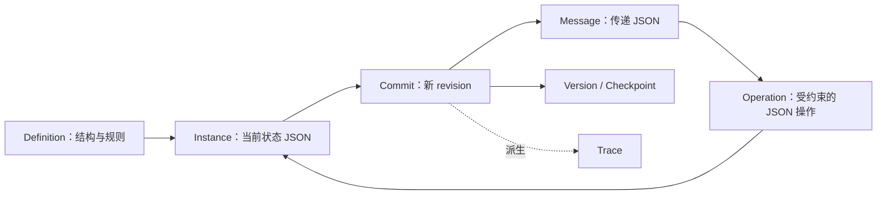
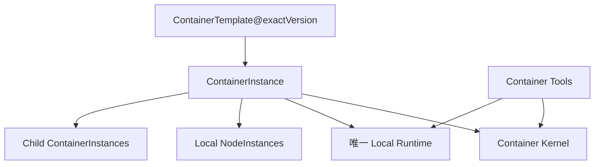
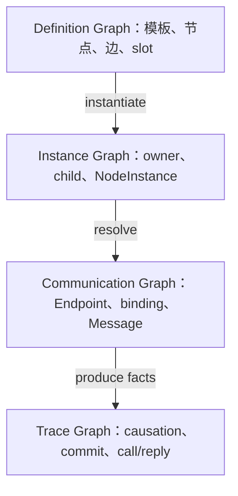

# Nodeflow Container V3 元模型

> 状态：**讨论基线 / 已确认概念，不代表实现**  
> 用途：整理当前对象边界，作为下一阶段统一协议、状态字段和行为测试的输入。  
> 非目标：本文不声称现有运行时代码已经符合本模型，也不冻结持久化、权限、重试和 Queue broker 的实现。

## 1. 核心命题：状态 JSON 的生成、操作与传递

整个系统可以归纳为：

> **Definition 约束可以存在什么状态；Instance 持有当前状态；Operation 操作状态 JSON；Message 在地址之间传递 JSON；Commit、Checkpoint 和 Trace 记录已经发生的事实及版本。**



“都是 JSON”不等于可以任意修改 JSON：

- Definition、Schema 和版本限定合法结构；
- 地址与 Capability 限定谁能操作哪个 Instance；
- Runtime 保护 envelope、关联、revision 和控制字段；
- Node、Agent 只能通过 Command 操作获准的状态片段；Servo/Adapter 只能转换 payload draft；
- 跨 Container 传 Message 和精确版本引用，不共享可变对象。

这里的“原子”首先是 **Instance 聚合边界**，不是把所有对象统一成 Container：

- 完整 `GraphDefinition + 初始化参数` 原子物化一个 ContainerInstance 及其本地 NodeInstances；
- 完整 `MessageDraft + 已解析路由` 原子形成一个 MessageInstance；
- `Instance@R + 合法 Command/ChangeSet` 原子形成 `Instance@R+1`；
- Graph、Message、JsonObject 各有自己的实例边界，不能仅因都由 JSON 表示就拥有同一种生命周期。

## 2. 三层对象模型

| 层 | 回答的问题 | 主要对象 |
|---|---|---|
| Definition | 允许如何运行？ | ContainerTemplate、Node/Endpoint/Edge/JsonTransform/ChildSlot Definition、MessageContract、Policy |
| Instance | 谁正在运行？ | ContainerInstance、NodeInstance、MessageInstance、可能的 QueueEntry |
| Record / Version | 已发生什么、引用哪一版？ | CommitRecord、CheckpointRecord、JsonObjectVersion、TraceSpan/Event、已发布 DefinitionVersion |

### 2.1 Definition

- 发布后不可变，以精确版本引用；
- 描述结构、约束、契约和策略；
- 不保存某次运行的节点状态、消息、child instance ID 或上下文。

### 2.2 Instance

- 具有稳定身份、地址、状态、所属关系和生命周期；
- 当前状态可以用 JSON 表示，但身份不等于 JSON 内容或 Trace ID；
- 同一 Template 可以创建多个相互隔离的 Instance。

### 2.3 Record / Version

- 已提交后不可变，用于恢复、引用、审计、复现和观测；
- `traceId` 不能代替 `containerInstanceId`；
- `CheckpointRecord` 不能代替运行中的 Checkpoint NodeInstance；
- `JsonObjectVersion` 不能成为共享可变会话；
- 一次 Node 执行不自动升级为长期 Instance。

## 3. 已讨论对象的归位

| 概念 | V3 归属 | 说明 |
|---|---|---|
| Workspace | `runtimeSlot(type=WORKSPACE) -> ContainerInstance` | 所有权、共享资产、文件和对象目录 |
| Graph | `runtimeSlot(type=GRAPH) -> ContainerInstance` | 图定义整体封装；实例负责节点调度、固定 Edge、Strategy、Context |
| Queue | `runtimeSlot(type=QUEUE) -> ContainerInstance` | 独立地址、生命周期、消息契约和投递规则 |
| Agent、普通、Strategy、Start、End | `NodeDefinition -> NodeInstance` | 用户模板内的节点类型 |
| Checkpoint | `Checkpoint NodeDefinition/Instance + CheckpointRecord` | 节点执行，成功 seal 后产生不可变锚点 |
| Subflow / Subagent | `NodeDefinition + ChildSlot + Child ContainerInstance` | 独立生命周期交给 child Container |
| Edge、JsonTransform | Definition | 固定连接与受限 JSON 转换规则，不产生普通运行实例 |
| Endpoint | Definition + 运行期地址解析 | 暂不需要 EndpointInstance |
| Message | MessageInstance | PUSH/CALL/REPLY、payload、关联及投递状态 |
| Asset、Plan、Spec、摘要、File Manifest | JsonObjectVersion 或内容引用 | 传精确版本，不依赖 Agent 隐藏历史 |
| Trace | TraceRecord | 从运行事实派生，只负责观测 |

Plan、Spec、Code 是用户定义的 Agent Member 或 Node 模板，不是 Kernel 内建类型；它们可以使用不同 ContextPolicy 和 CapabilityPolicy。

## 4. ContainerTemplate：接口、唯一 Runtime Slot 与 Child Slots

`ContainerTemplateVersion` 是一个完整发布单元。Graph 定义不再与 MessageContract、事务配置平铺在根级，而是整体封装进恰好一个 `LOCAL_RUNTIME` slot：

```json
{
  "templateId": "coding-flow",
  "definitionVersion": 4,
  "interface": {
    "publicEndpointDefinitions": {},
    "messageContractRefs": {}
  },
  "kernelConfig": {
    "stateSchemaRef": "graph-state@2",
    "capabilityPolicyRef": "graph-capability@3"
  },
  "runtimeSlot": {
    "slotId": "main",
    "role": "LOCAL_RUNTIME",
    "runtimeType": "GRAPH",
    "definition": {
      "nodeDefinitions": {},
      "internalEndpointDefinitions": {},
      "edgeDefinitions": [],
      "jsonTransformDefinitions": {},
      "strategyDefinitions": {},
      "checkpointDefinitions": {}
    }
  },
  "childSlotDefinitions": {}
}
```

`runtimeSlot` 是封闭联合：

| runtimeType | definition 内容 |
|---|---|
| `GRAPH` | Node、内部 Endpoint、Edge、Servo/Adapter、Strategy、Checkpoint |
| `QUEUE` | QueueContract、顺序/优先级、claim、delivery、consumer binding |
| `WORKSPACE` | JsonObject/File Manifest、资产目录和文件能力 |

一个 TemplateVersion 只能选择其中一种，不能并列多个本地 runtime。需要 Graph + Queue 或多个 worker 时，用 ChildSlot 组合独立 ContainerInstance，避免 kind 冲突和 God Object。

Template 负责：

- 声明公共 `interface`、Kernel 配置和唯一 Runtime Definition；
- 声明允许存在的 child slots；
- 分开声明 public Endpoint 与 runtime 内部 Endpoint，并定义 binding；
- 固定 MessageContract 和各种 Policy 引用；
- 约束实例状态结构及可用操作；
- 修改时产生新的 `definitionVersion`，不原地覆盖。

Template 不保存：

- Instance 当前消息、上下文和节点状态；
- child、Queue 或消费者的实际 instance ID；
- Trace、CheckpointRecord 和文件内容；
- Agent 临时发现后未经控制面批准的运行期改动。

## 5. ContainerInstance：Kernel、local runtime 与 tools



### 5.1 公共 Container Kernel

Kernel 至少负责：

- `containerInstanceId`、exact `templateRef`、`runtimeType`、owner；
- 最小生命周期和当前 `revision`；
- NodeInstance 物化与本地索引；
- child ownership 和 binding；
- Endpoint 地址解析与公开边界；
- PUSH/CALL/REPLY 接收入口；
- MessageContract、Capability 和 pending CALL 校验；
- 本地原子提交、冲突检测与 revision 推进；
- 产生 CommitRecord 以及 Checkpoint/Trace 所需事实；
- JsonObject 精确版本引用的访问边界。

Kernel 不实现 Graph 调度算法、Queue 排序或 Workspace 文件语义。

### 5.2 Local runtime

| runtimeType | 专属职责 |
|---|---|
| `WORKSPACE` | owner、模板许可、共享资产、JsonObject/File Manifest 目录、child 管理 |
| `GRAPH` | readiness、Strategy、Edge、Servo、Context 编译、Checkpoint 执行 |
| `QUEUE` | 入队契约、QueueEntry、顺序/优先级、claim、投递与 CALL 消费规则 |

Local runtime 是解释唯一 Runtime Definition 与 ContainerInstance 状态的代码，不是另一类业务 Instance，也没有独立地址或 revision。

### 5.3 R0 原子物化与可见性

单个 ContainerInstance 创建必须先在不可见状态完成并校验：

```text
固定完整 ContainerTemplateVersion + 初始化参数
  -> 物化 ContainerInstance@R0
  -> 若为 GRAPH：一次性物化全部本地 NodeInstances
  -> 构建 Endpoint / Edge / Servo / pending-call 等本地索引与通信状态
  -> 写入初始 CommitRecord
  -> 单次发布地址并进入 OPEN
```

提交前不接收 DATA 消息、不触发 Start Node，也不暴露半成品地址；失败不留下部分可运行的图。Agent 会话、模型或 MCP 连接可延迟建立，但对应 NodeInstance 的身份和初始状态必须已存在。

Child Container 仍是独立 Instance：parent 可以通过 required-child 激活屏障获得“整体原子可见”，但不宣称 parent 与全部 child 存在跨容器 ACID 事务。

### 5.4 Container tools

| 面 | 示例 | 边界 |
|---|---|---|
| 数据面 | `push`、`call`、`reply` | 向公开或授权地址传业务消息 |
| 控制面 | `instantiateChild`、`bindChild`、`close`、`sealCheckpoint`、`applyChangeSet` | 基于明确 target 和 base revision/version 改实例配置或状态，需管理 Capability |
| 观察面 | `describe`、`listEndpoints`、`queryTrace` | 查询定义、状态投影或 Trace |
| Runtime 内部面 | `claim`、`route`、`commit`、`rollback` | 不直接暴露给普通 Agent/MCP |

Tool 默认是无状态适配器。若它自身需要模板、持久状态、生命周期和外部地址，应升级为 ContainerInstance。

## 6. NodeDefinition 与长期 NodeInstance

当前默认规则是：

> **同一 `ContainerInstance` 内，一个 `NodeDefinition` 只物化一个长期 `NodeInstance`。**

```text
ContainerInstance A × NodeDefinition planner = NodeInstance A/planner
ContainerInstance B × NodeDefinition planner = NodeInstance B/planner
```

Graph 循环再次经过同一节点，不重复创建 NodeInstance；每次执行只产生轻量执行事实或 Trace span。

NodeInstance 最小内容：

```text
containerInstanceId
nodeDefinitionId
status
nodeState JSON
contextStateRef
input/message indexes
inflight claims
```

NodeInstance 有完整但从属于 Container 的生命周期和 Trace 身份。最小生命周期暂定：

```text
CREATED -> OPEN -> CLOSED
```

### 6.1 单例与多例约束

当前基线禁止：

- 同一 ContainerInstance、同一 NodeDefinition、同一地址既按单例又按多例解释；
- 运行中临时把单例节点变成多个不可区分实例；
- 多个实例共享可变 node state 却声称隔离。

需要多份状态时，首选创建多个 ContainerInstance。若以后证明同一 Container 内必须多例化，Template 必须显式声明 `MULTI` 并加入稳定 `instanceKey`：

```text
{containerInstanceId, nodeDefinitionId, instanceKey, endpointId}
```

`SINGLETON` 与 `MULTI` 是 TemplateVersion 级互斥语义，不能在同一地址同时出现。首版是否支持 `MULTI` 仍开放。

### 6.2 何时升级为 Child Container

若局部主体需要独立模板、创建/关闭、revision、Checkpoint、外部地址、权限、消息入口或被其他实例共享，应升级为 Child Container，而不是继续扩张 NodeInstance。

## 7. ChildSlotDefinition 与子容器

ChildSlotDefinition 声明“这里允许绑定什么 child”，不代表 child 已经创建。

```json
{
  "slotId": "workers",
  "allowedRuntimeTypes": ["GRAPH"],
  "allowedTemplateRefs": ["code-worker@3"],
  "cardinality": "MANY",
  "ownership": "OWNED"
}
```

实例化后由 parent 保存 `childBindings[slotId] -> childContainerInstanceId[]`。约束是：

- child 定义约束来自 slot，实际 ID 只存在于 Instance 层；
- OWNED child 只有一个直接 owner，ownership 图无环；
- child 拥有自己的 NodeInstances、revision、Context、Checkpoint 和公开 Endpoint；
- parent 与 child 通过统一消息协议沟通，不共享可变 node state；
- required child 全部就绪后，parent 在一次本地提交中固定 binding snapshot 并公开；这只保证 parent 的激活可见性，不合并 child 的提交事务；
- slot 的 `ONE/MANY` 与 Node 的 `SINGLETON/MULTI` 是两套不同基数。

## 8. Endpoint 地址与显式公开

内部 Node Endpoint 地址可由 Container 和定义 ID 派生：

```json
{
  "containerInstanceId": "graph-17",
  "nodeId": "planner",
  "endpointId": "result"
}
```

它可用于 Runtime 路由和 Trace，但可寻址不等于允许外部调用。外部默认只能面向 Template 显式声明的 public Endpoint：

```text
{containerInstanceId, endpointId}
```

public Endpoint 可绑定到本地 Node Endpoint、直接 child slot 暴露的 Endpoint、Queue 入口或受保护的 control/observe handler。

EndpointDefinition 不固定成 input 或 output 两种类型。同一 Endpoint 可以分别声明允许 `receive` 和 `emit` 的 PUSH/CALL/REPLY 及对应 contract；例如调用端 Endpoint 可以 `emit CALL` 并在原处 `receive REPLY`，被调用端则相反。方向来自本次操作和已定义关系，而不是 Endpoint 的永久类别。

外部不能猜测内部 nodeId 绕过公开边界。Endpoint 当前只是 Definition 加运行期 binding；仅在出现独立启停、扩缩容或持久状态时才考虑 EndpointInstance。

## 9. Edge、JsonTransform 与 Strategy

Edge 是 `GraphDefinition` 内的固定关系：连接本地 Node Endpoint 或已声明 child slot Endpoint；实例化时解析成实例地址，运行中不能创建、删除或改写。任意 Container 间的临时通信使用 public Endpoint，不制造全局动态 Edge。

### 9.1 JsonTransformDefinition 与绑定位置

`JsonTransformDefinition` 是无状态、确定性的 **Message payload draft** 变换定义。在不同传输绑定位置使用不同语义名称，但可复用同一受限引擎：

| 绑定位置 | 语义名称 | 变换方向 |
|---|---|---|
| Graph Edge | Servo | source payload -> target payload |
| public Endpoint binding | EndpointAdapter | 外部 contract <-> local runtime contract |
| ChildSlot / Queue / Connector binding | Adapter | parent/producer/internal contract <-> 对端 contract |

Container 可以在明确的 Endpoint/binding 上引用 Adapter，但**不存在 Container global Servo**；根级钩子缺少端点、方向和 operation，会产生隐藏行为。

其他 JSON 编辑/适配使用不同的语义 Definition：`InitializerDefinition` 只处理尚未公开的 InstanceDraft；`VariableProjectionDefinition` 只产生 Strategy 判断变量；`MigrationDefinition` 只能由显式版本迁移流程调用；`ProjectorDefinition` 永远只读。它们最多共享受限的纯 JSON 映射内核，不共享 Schema、可写目标或 Capability。不能因为实现引擎相同，就合并成一个可编辑任意 JSON 的万能 Definition。

CALL 的双向适配显式固定：

```json
{
  "binding": {
    "target": "main/planner/task",
    "forwardTransformRef": "external-to-plan@2",
    "replyTransformRef": "plan-to-external@1"
  }
}
```

CALL MessageInstance 创建时把确切 `replyTransformRef@version` 与 callback 一起保存；REPLY 不重新选择 Edge 或最新 Adapter。

### 9.2 Servo 与 Strategy 的硬边界

| Servo / Adapter | Strategy Node / Policy |
|---|---|
| 已知 source、target 和 operation 后转换一个 payload draft | 汇集输入消息和持久策略状态 |
| 不等待、不选路、无跨轮记忆 | 判断全量/FIFO/选择/交叉/循环条件 |
| 只返回新 payload | 决定何时计算、触发哪些 Edge、同步/异步、优先级和输出方式 |
| 失败即本次 Message 创建失败 | 可产生显式等待、选择和控制结果 |

Strategy 内部的 `VariableProjectionDefinition` 可以复用纯 JSON 映射内核，但它只是把已选输入映射成判断变量：不能借此发送消息、选 Edge 或修改状态。随后由 evaluator 执行表达式/规则或受控 Agent 判断，再由 trigger/output policy 把结果映射为已定义 Edge 的触发提案。

明确流水线是：

```text
Strategy/InputPolicy 聚合输入并作逻辑判断
  -> Strategy/OutputPolicy 选择已定义 Edge 和触发模式
  -> Runtime 解析地址与固定 contract/transform 版本
  -> 校验 source contract -> Servo/Adapter -> 校验 target contract
  -> Runtime 构造受保护 envelope
  -> 原子创建 MessageInstance
```

Servo 只能读取 payload draft 和最小只读 route/endpoint/contract 元数据，只能返回新 payload；不得改 target、operation、callback、correlation、cyclePath、revision、Capability、Trace 身份或拓扑，也不得调用网络、时间、随机数、Agent/MCP。多出边使用独立 payload 副本；fan-out 原子性仍待协议确认。

Definition 编辑必须提交 `DefinitionChangeSet` 生成新 DefinitionVersion；Instance/Node/Queue/JsonObject 状态修改必须经 Command/ChangeSet 和 Kernel commit。二者都不是 Servo 职责。若变换需要状态、等待、重试或副作用，应升级为 Strategy、Node 或 Child Container，而不是增加 ServoInstance。

## 10. 四种图与最小索引

“系统由容器嵌套构成”不表示所有关系都塞进一棵树。



| 图 | 核心性质 |
|---|---|
| Definition Graph | 由 `templateId + version` 定位，发布后不可变 |
| Instance / Ownership Graph | Container 单父无环；NodeInstance 只属于一个 Container |
| Communication Graph | Endpoint 和 Message 构成，可循环；变化不等于改拓扑 |
| Trace / Causality Graph | 关联 Message、execution、Commit、Checkpoint；只做观测 |

最小索引如下：

| 索引 | 最小键 |
|---|---|
| DefinitionIndex | `(templateId, definitionVersion)` |
| InstanceIndex | `containerInstanceId` |
| OwnershipIndex | `ownerInstanceId -> childInstanceIds` |
| NodeIndex | `(containerInstanceId, nodeId[, instanceKey])` |
| EndpointDirectory | public/internal endpoint address |
| MessageIndex / PendingCallIndex | `messageId / callMessageId` |
| CommitIndex | `(containerInstanceId, revision)` |
| ObjectVersionIndex | `(objectId, objectVersion)` 或内容哈希 |
| TraceIndex | `traceId / spanId / causationId` |

这些索引可共用物理存储，但概念键不能互相替代。

## 11. 统一通信与本地提交边界

节点间、容器间、Queue 与 Graph、外部与 Container 应收束为同一种版本化 JSON envelope；具体字段下一阶段冻结。

当前确认：

- PUSH 是单向业务投递；
- CALL 创建可精确关联的业务等待，但不阻塞整个 Container；
- REPLY 只能解析指定 CALL，并满足 reply contract；
- technical receipt 不能冒充业务 REPLY；
- control/observe 可复用 envelope，但 Endpoint 类型和 Capability 来自受信任 Definition。

一次本地状态变换是：

```text
读取 Container revision R 和精确对象版本
  -> claim 输入 Message
  -> 执行 Node / Agent / Strategy
  -> Strategy/OutputPolicy 选择固定 Edge
  -> 校验 source contract，Servo/Adapter 转换 payload，再校验 target contract
  -> 原子提交 R -> R+1
       更新 Node state、消费输入、创建输出 Message
       记录 JsonObjectVersion refs 和 CommitRecord
       更新本地 Checkpoint/CALL/Queue 状态
  -> 从提交事实派生 Trace
```

跨 Container 不假设分布式事务：源和目标各自本地提交，通过 Message 协作。可靠投递所需的 outbox、幂等、ACK/lease 和 retry 后续讨论。

## 12. Checkpoint、JsonObject、Context、文件与 Trace

### 12.1 语义归属

| 对象 | owner / 真相位置 | 性质 |
|---|---|---|
| Container state | ContainerInstance revision | 当前可变状态 |
| Node state / context refs | NodeInstance，受 Container commit 保护 | 当前可变状态 |
| Checkpoint Node state | Checkpoint NodeInstance | 当前 epoch、待 seal 信息 |
| CheckpointRecord | 产生它的 Container revision | seal 后不可变锚点 |
| JsonObject identity | 一个明确 owner Container；共享文件/资产默认由 Workspace 管理 | head/ref 可变 |
| JsonObjectVersion | object owner；跨边界只传精确 ref | 不可变内容 |
| Context summary | JsonObjectVersion，由 NodeInstance 引用 | 压缩产物，不替代原始事实 |
| File Manifest | Workspace 管理的 JsonObjectVersion | 路径到内容版本的不可变视图 |
| TraceRecord | 观察子系统，记录 source instance/commit | 派生记录，不拥有业务对象 |

物理存储可以集中，但语义 owner 必须唯一；多方引用不等于共享可变 JSON。

### 12.2 五种版本身份

| 身份 | 含义 |
|---|---|
| definitionVersion | 实例固定使用哪版定义 |
| containerRevision | 容器成功提交到第几次 |
| objectVersion | Plan、Spec、摘要、Manifest 是哪版 |
| cycleEpoch/path | 位于哪个 Checkpoint 循环窗口 |
| traceId/spanId | 如何观察因果链 |

Trace 身份不能代替前四者。

### 12.3 Checkpoint 联结版本

Checkpoint seal 后的 Record 至少引用：

```json
{
  "checkpointId": "implementation-loop:4",
  "source": {"containerInstanceId": "graph-17", "nodeId": "checkpoint"},
  "atContainerRevision": 43,
  "definitionRef": "coding-flow@3",
  "cyclePath": [{"checkpointNodeId": "implementation-loop", "epoch": 4}],
  "objectRefs": {
    "plan": "plan@4",
    "spec": "spec@6",
    "contextSummary": "code-summary@7",
    "fileManifest": "workspace-files@18"
  }
}
```

CheckpointRecord 不复制完整 Container，也不替代恢复日志；恢复仍依赖 durable Snapshot 与 CommitRecords。Checkpoint 是业务版本锚点。

### 12.4 Context 压缩和文件修改

上下文压缩生成新的 ContextSummary JsonObjectVersion，并记录 PolicyVersion、压缩覆盖的 revision/message、source refs 和 cycle 信息；下一轮由 pinned refs、summary、未压缩 tail 与当前 Message 重新编译 Context。

文件以版本化 JSON Manifest 表示 `path -> contentRef + digest`。Code Node 提交带 `baseObjectVersion` 的 JSON ChangeSet；Workspace 返回新 Manifest ref，Graph 再在本地 commit/checkpoint 中记录它，不直接跨容器改共享状态。

Context budget 是版本化配置。当前倾向普通模型约 200k，上层和模型共同允许时可扩到 1m；Plan、Spec、Code 使用不同压缩策略。精确预算、触发阈值和保留顺序仍开放。

### 12.5 Trace 只解释，不裁决

Trace 应关联 Instance、Node execution、Message causation、CALL/REPLY、Commit、Checkpoint、JsonObjectVersion 和 Edge/Servo 摘要。但 Runtime 不得扫描 Trace 来判断消息是否消费、组合是否发射、Checkpoint 是否 sealed 或对象当前版本；这些事实属于 Instance state、CommitRecord 和版本索引。

## 13. 已确认的概念基线

1. 主逻辑是受 Definition 约束的状态 JSON 生成、操作和传递。
2. 对象分 Definition、Instance、Record/Version 三层，身份不混用。
3. ContainerTemplate 由公共 interface/kernelConfig、恰好一个 Local Runtime Slot 和 Child Slots 构成。
4. `GRAPH/QUEUE/WORKSPACE` 是互斥 runtimeType；GraphDefinition 整体封装在 GRAPH slot，普通 Node 不是 Container。
5. 同一 Template 可创建多个隔离 ContainerInstance。
6. 同一 Container 内，同一 NodeDefinition 默认对应一个长期 NodeInstance；循环不重复实例化。
7. 同一 Node 地址不能同时具有单例和多例语义；多份状态优先用多个 ContainerInstance。
8. 需要独立模板、生命周期、revision、地址或权限的主体升级为 Child Container。
9. NodeInstance 有从属生命周期、内部地址和 Trace 身份。
10. 外部只能访问显式 public Container Endpoint。
11. Endpoint 不是永久 input/output 类型；同一 Endpoint 可分别声明 receive/emit 能力。
12. Edge、JsonTransform、ChildSlot 是 Definition；实际 child 是 ContainerInstance。
13. Servo/Adapter 只转换已选传输关系上的 payload；没有 Container global Servo。
14. Strategy 汇集输入并作逻辑判断、选择和触发；Servo 不等待、不选路、无跨轮状态。
15. CALL 固定 forward/reply transform 版本；等待属于 Message，REPLY 走原 CALL callback。
16. 单个 ContainerInstance 的 R0、本地 NodeInstances、索引和通信状态原子物化并一次公开；child 不承诺分布式 ACID。
17. Definition 编辑走 DefinitionChangeSet；实例状态修改走 Command/ChangeSet 与 Kernel commit。
18. Definition、Instance、Communication、Trace 是四种不同的图；Trace 只观测。
19. Checkpoint、Context、Plan/Spec、File Manifest 通过精确对象版本和 Container revision 联结。
20. 运行中的 ContainerInstance 首版固定精确 DefinitionVersion，不热改拓扑。

## 14. 开放项与下一步

尚未确认：

- envelope 字段、状态机、错误、取消、receipt、幂等和版本协商；
- public Endpoint/child binding 语法及 control/observe 权限；
- 是否首版支持 `MULTI + instanceKey`、Node pause/resume 和 ExecutionRecord；
- 多出边默认行为、JsonTransform 操作语言和 fan-out 原子性；
- Queue provision、QueueEntry、FIFO/优先级、claim/lease/ACK/retry/pub-sub；
- Checkpoint seal、cyclePath、CROSS_RETAIN、迟到消息、pause/resume/fork；
- 200k/1m 预算计算、Plan/Spec/Code 默认策略、摘要格式；
- JsonObject ChangeSet 冲突、Manifest 与物理文件/Git/沙箱投影；
- Commit/Snapshot/Trace 存储、outbox、恢复和显式 Definition migration。

下一轮建议顺序：

1. 冻结 Address 与 EndpointDefinition；
2. 冻结统一 Message envelope；
3. 分别写 PUSH、CALL、REPLY 状态机；
4. 定义本地 commit 和跨 Container 交付；
5. 定义 Edge 选择、Servo 输入输出与 fan-out；
6. 定义 Checkpoint seal、JsonObjectVersion、Context/File 引用；
7. 最后把 Queue 入队、claim、消费和回调映射到同一协议。

每新增一个持久对象或状态，都继续检查：

> **哪一个已确认场景无法在没有它的情况下被正确表达？**

若没有明确答案，应优先表示为已有 Instance 的 JSON 状态、不可变 Record 或派生索引，而不是增加新的顶层运行主体。
