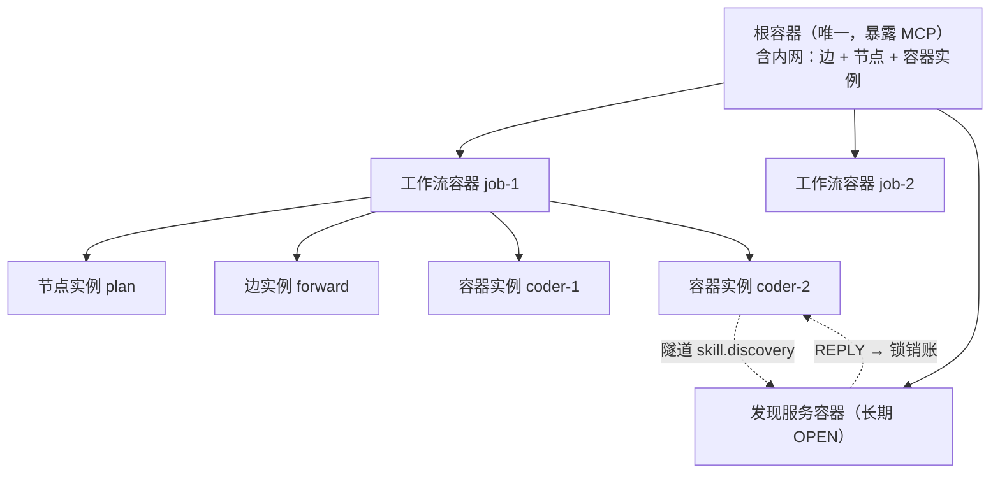

# Nodeflow V5 基础设计 —— 嵌套容器运行时

> 状态：**基础重建稿（2026-08-17）**。取代 `FOUNDATION_V4.md` 作为概念入口。
>
> 版本关系：
> - **V4（`nodeflow_*.py` + 339 条测试）降级为行为参考**。执行面 / 版本面 / 上下文估算面继续有效并直接继承（§14）；**编排面的对象模型被本文推翻**。
> - V2 / V3 文档已是历史资料，按 §14 取舍表处理。
> - 本文的直接上游是最初草稿 `nodeflow.md`——V4 在 §6 降级表里把"容器"从四种含义砍到三种，砍掉的那一种（traceid 层级 + 触发宿主）是本轮重建的起点。

---

## 0. 为什么重做

一句话诊断：

> **V4 把"消息传递"当成第一性的东西，于是"容器"被挤成了一个形容词；容器一旦不是实体，它的职责就散成 `ContainerSlot` / `SubscriptionDefinition` / `children` / `pool_cursor` / `overflow` 五套并存的机制，每套各长一份规则、一条失败路径、一批测试。**

V5 把第一性换成**嵌套与生命周期**。换完之后发生了三次归约，每次都是把 N 套并存的机制证明成一套：

| # | 归约 | 消掉了什么 |
|---|---|---|
| 1 | **容器 is-a 实例** | slot / subscription / children / pool_cursor / overflow → 一棵实例树 |
| 2 | **资产即变量** | 卡片系统 + 四段上下文编译器 + 运行时预算裁剪 → 一套变量 |
| 3 | **等待即锁（网关账本）** | callback WAITING / child OPEN / approval AWAITING / 订阅 / PAUSED / 定时器 → 一张锁表 |
| 4 | **版本历史即状态**（2026-08-17） | **策略节点 / 表达式语言 / 节点内 persistent / 多消息原子消费 / 内核时钟** → ObjectStore 的版本历史 |

第 4 次归约是这套设计里最省的一刀，值得展开（§6.1）：
节点内 `persistent` 状态和「等齐 N 条消息再原子消费」，本质上是在**重新发明 ObjectStore 已有的东西**——

> **版本历史 = 累加器 + 计数器 + 择优的候选集。**

`plan@3` 就是第三轮；三个 coder 各写一版 `results`，`history("results").length === 3` 就是等齐。
而且它比节点内状态好：已经版本化、已经可观测、已经进因果记录、跨实例可见。
节点内 persistent 是个藏起来的私有状态 —— 正是本项目一直在消灭的那类东西。

判断一个设计是否在收敛，看它每轮是在加对象还是在减对象。V4 那几轮是每解决一个问题就加一个对象。

---

## 1. 命题与四个目标

### 1.1 命题（继承 V4，落点改变）

> **把长任务切成多个短上下文的 agent 执行，用边编排它们、用版本化产物缝合它们，从而避免单 agent 上下文膨胀与注意力涣散。**

V4 的落点是 `InvocationContext {head, messages, tail, transient}` 四个数组 + 运行时按优先级裁剪。**裁剪是补救，不是构造。**

V5 的落点是**端口变量声明**：一个 agent 能看到什么，等于它的端口和 bind 段声明的变量集合，**在模板注册期就是有限且已知的**。

推论，也是 V5 与 V4 最实质的差别：

> **上下文预算从"运行时救火"变成"注册期拒绝"。**
> 超预算的图注册不进去，而不是跑起来之后报 `compactions > 0`。

### 1.2 四个目标（一切设计必须指回其中之一）

| # | 目标 | 主要落点 |
|---|---|---|
| G1 | **AI 经 MCP 自动搭建工作流** | 容器各部分开放为 MCP 工具；统一 json 配置；注册期 LLM 可读错误 |
| G2 | **自动进化** | 容器版本管理（多层继承）；提案/审批；标注检索；运行时可改内网 |
| G3 | **人有完整权限** | 根容器 MCP 全权；审批；强制截断；一切变更进版本可回滚 |
| G4 | **画布渲染修改 + 实时进度** | `_layout` 独立版本；锁表直接渲染；观测投影；内网可查当前形态 |

---

## 2. 主线剧本

所有对象必须能指回下面某一帧。指不回的，删。

**场景：给现有项目加一个「导出」功能。**

| # | 发生什么 | 逼出什么 |
|---|---|---|
| 0 | 人在根容器处提需求（根容器暴露 MCP，人与助手 AI 同层） | 根容器唯一；MCP 网关 |
| 1 | 助手 AI 检索卡片，`propose` 一个工作流容器模板，**注册期校验通过才落提案** | G1 的内循环；提案即校验 |
| 2 | 人在画布上改坐标 + 覆盖一条节点定义路径，**改坐标不产生新模板版本** | `_layout` 独立版本 |
| 3 | 人批准 → 模板 `export-flow@1`；实例化为工作流容器 `job-1` | 提案/审批；容器实例化 |
| 4 | `job-1` 内网里的 Plan 节点由 3 张卡编译：`rules/py-strict@3` + `prompt/coder@1` + `mcp/git@2` | bind 段；稳定前缀 |
| 5 | 有人把 `rules/py-strict` 改成 `@4`；**在途的 `job-1` 仍用 `@3`** | 实例 pin 容器版本，活跃期不漂移 |
| 6 | Plan 产出 `plan@1`；向控制隧道发审批 REQUEST → **内核记一把 `request` 锁**（审批不是新锁种），画布显示"等 alice" | 锁 = 网关账本；G4 |
| 7 | 人改一处，`plan@2`，审批 REPLY 到达 → 锁销账 | 锁释放 |
| 8 | 容器工具按 `plan@2` 建 **3 个 coder 容器实例**，traceid = `job-1/coder-1..3` | 容器嵌套；traceid 层级 |
| 9 | coder#2 缺 skill，向 `skill.discovery` 隧道发 REQUEST + callback；**内核记一把 `request` 锁** | 网关；隧道标签寻址 |
| 10 | 发现服务（另一个长期 OPEN 的容器实例）回复 → skill 作为 **long 变量**追加；coder#1/#3 不受影响 | 资产即变量；实例隔离 |
| 11 | `job-1` 的 metrics 节点**订阅自己子树**：`标签=progress ∩ traceid前缀=job-1/`，收不到其他 Job 的进度 | **traceid 作用域过滤**（V4 表达不了） |
| 12 | 三路各写一版 `results`；merge handler 读到 `history` 满三条才往下 → 跑测试 → 1 个用例失败 | **版本历史即汇聚**（C5）|
| 13 | 判定节点（agent 或受信 handler）写一条**标注**并选 `again` 端口，沿回边回到 coder；**epoch 就是标注的版本号** | 循环靠回边；C5 计数 |
| 14 | **epoch 2 的变量只含失败用例 + 相关文件切片**，rules/角色不变（稳定前缀未动） | **命题核心** |
| 15 | 人中途改需求 → 对 `job-1` **强制截断**：在途执行取消、未消费消息留计数、**反向清掉 coder 对 job-1 的锁**、级联截断三个子容器 | 强制截断 6 步 |
| 16 | 助手 AI 检索历史标注，发现"测试总在同一处失败"，`propose` 改进版模板 → 回到帧 1 | G2 进化闭环 |

第 14 帧是整个系统存在的理由。设计取舍冲突时，优先保它。
第 11 帧是 V5 相对 V4 新增的能力，也是"容器"被砍掉那一半的价值证明。

---

## 3. 第一性：容器 is-a 实例

### 3.1 递归定义

```
实例  = 由某个模板创建、有生命周期、由 traceid 标识的运行对象
容器  = 实例的一个子类：它自己有内网（可含节点、边、其他容器）
```

因为容器是实例，容器可以被容器包含 —— **嵌套是定义的直接推论，不是额外机制**。

### 3.2 根容器：递归的终止条件

> **不变量 C1 —— 根容器唯一，不由任何模板创建。**

- 根容器的 json 是**启动配置**，不是模板实例化的产物（"模板即自身，单例"）。它同样是 `ObjectVersion(kind="root_config")`，启动时 pin 一个版本；编辑产生新版本，**重启生效，不做热 reload**（与 §5.5 的终身 pin 一致）
- 根容器**自身含边**，也就是说它本身就是一个工作流；它内网里的容器实例，各自是具体 agent 工作流的根
- **层级完全均质，没有特例层**：不存在"不在容器里的节点"这种东西
- 顶层助手 AI 与人是根容器**网关的外部调用方**——他们的位置由结构给出，不用另设

### 3.3 traceid

> **不变量 C2 —— traceid 是实例路径，容器是层级发生器。**

```
job-1
job-1/coder-2
job-1/coder-2/review-1
```

traceid 必须**可前缀匹配**。它同时承担三件事：

| 用途 | 帧 |
|---|---|
| 实例身份与所有权 | 全部 |
| **队列订阅的作用域过滤** | 11 |
| 观测投影的子树查询（一次前缀查完，不递归爬指针） | 15、G4 |

这是 V4 完全缺失的维度：V4 用扁平 `gid` + `parentGraphInstanceId` 指针表达所有权，能回溯但**不能前缀过滤**，所以"只订阅我这棵子树里的消息"表达不了。

> **traceid 不表达因果。** 它回答 who / where（所有权树），回答不了 what-caused-what：
> 扇出后三条子消息 traceid 各不相同却同源；汇聚时一条输出有多个前因。
>
> 因果由 **RunSnapshot 承担**——每次提交本来就记录了本次消费的输入集与产出的输出集，**那就是因果边**。消息本身只带协议必需的 `in_reply_to`（关联 REPLY），不额外存 `causation_ids`：那是冗余存储，同一事实在提交记录里已经有了。

### 3.4 结构图



---

## 4. 实体表

### 4.1 唯一的一等公民：实例

| 实例形态 | 是什么 | 有内网 | 可持锁 |
|---|---|---|---|
| **容器实例** | 有内网的实例 | ✅ | ✅ |
| **节点实例** | handler（`agent` 段可选） | ❌ | **❌ 锁的 owner 唯一是容器** |
| **边实例（纯转发）** | handler = forward | ❌ | **❌ 结构上够不着** |
| **边（非纯转发）** | **就是容器实例**，不是第三类 | ✅ | ✅ |
| **消息实例** | 传递中的载荷 + 投递状态 | ❌ | ❌ |

> **非纯转发的边不是"特殊边"，它是容器。**
> 因为它有并发与竞争，就需要生命周期和边界，那正是容器的定义。复杂度往下压一层，不往旁边加一类。

### 4.2 非实例的东西

| 对象 | 说明 |
|---|---|
| **定义模板** | 容器/节点的 json 定义。是 `ObjectVersion` 的一个 kind |
| **变量** | 节点实例内的数据，不是独立实体（§7） |
| **锁** | 网关账本的一行，不是独立实体（§9） |
| **ObjectVersion** | 版本分配的唯一权威。承载：卡片 / 契约 / 策略 / servo / 隧道定义 / 容器模板 / 提案 / 产物 / 标注 / run 快照 / layout |
| **Principal** | `kind:id`，kind ∈ human/agent/system/service，必须由可信边界注入 |

**定义层全部并入 ObjectStore**，不再有 V4 那 14 张平行注册表。理由：`_cards / _contracts / _policies / _transforms / _topics` 五张表是同构的（稳定 id + 版本 + 不可变 body + 精确引用 + 重复拒绝），而 `GraphTemplate` 早已在 ObjectStore 里。并进去之后：

- 5 套重复注册守卫 → `ObjectStore.put` 的内容寻址幂等
- 提案/审批从"只覆盖模板"泛化到**所有 kind**（AI 可以提案一张卡、一条契约、一个策略）
- "定义层刻意不落盘"这条限制消失

唯一例外：内置 handler 是函数，存不了 —— 但它不是定义对象，是**内核能力常量表**，与节点 kind 枚举同级。

---

## 5. 容器定义的八个部分

统一 json 配置；每一部分都开放为 MCP 工具（G1）；**可在运行时更改，但按 §5.5 的规则生效**。

| # | 部分 | 职责 |
|---|---|---|
| 1 | **实例创建模板** | 本容器内可以创建哪些实例，用什么模板 |
| 2 | **网关** | 内外交换信息的方式：隧道匹配 / 队列订阅 / 父子调用（CALL/REPLY）|
| 3 | **容器工具** | 操作和编辑实例或模板（G2 的进化入口）|
| 4 | **内网** | 实例间通信 = 边，**注册为实例** |
| 5 | **版本管理** | 多层继承；每次编辑进版本，可回滚 |
| 6 | **权限管理** | Principal 校验；谁能创建、编辑、截断 |
| 7 | **生命周期** | 关闭条件、`on_close`、`max_blocked_duration` |
| 8 | **观测投影** | 只读、不裁决：子树状态、当前内网形态、锁表、提前遍历 |

第 7、8 是本文补的。第 7 补的理由：前六部分覆盖了创建、通信、自修改、演进、授权，**唯独没有终止**——而 V4 在终止上翻过三次车。第 8 补的理由：G4 需要"边渲染要看内网变化、提前遍历状态"，那是观测能力不是渲染能力。

### 5.5 版本管理：eager 物化继承

> **不变量 C4 —— 实例终身 pin 住创建时的容器定义版本，永不迁移。**

编辑落成容器定义的**新版本**；已存在的实例继续用创建时 pin 的版本直到终态；**要用新版就创建新实例**。

不做 idle 热迁移：迁移协议要处理"迁移点在哪、状态怎么映射、迁到一半崩了怎么办"，而它买到的东西（省一次实例化）在单进程里约等于零。

这条不加，agent 会在执行中途看到自己脚下的图变了 —— 那正是本项目要消除的注意力涣散的结构版本。

#### 多层继承在**实例化时**解析，不在读取时

容器定义是路径寻址的（`nodes/coder/ports/in/vars/task`），所以子容器可以只覆盖若干路径。
覆盖的解析时机有两种，**必须选 eager**：

| | 何时解析 | 后果 |
|---|---|---|
| **Eager（选它）** | 实例化时把继承链解析成一份完整定义，存为 `ObjectVersion(kind="materialized")`，实例 pin 它 | 改基模板不影响已有实例 |
| Lazy | 每次读走继承链 | 支持"改基模板影响子模板"，但**让 C4 的 pin 变成谎言**——实例说自己定版了，读出来的东西却会变 |

物化产物本身是版本化对象 ⇒ **可回溯、可 diff、可作为画布的真相源**。

**推论：热更新彻底没有。**改模板 → 新版本 → 新实例。这与"暂停即截断、恢复即重建"是同一个哲学：
**不做热恢复，做重建。**

---

## 6. 节点、端口、servo

### 6.1 节点只有一类

```
handler  —— 唯一的节点种类。带 `agent` 段就走执行面 backend，不带就走内置 handler。
```

> **JSON 判别式：`kind: "handler"`。**没有第二个值。
> agent 由 `agent` 段的**存在性**判别，不引入枚举。

#### 策略节点为什么被删掉

V4 与本文早期稿都把策略节点当一等对象，为它设计了 readiness × selection × output 矩阵、
表达式语言、节点内 `persistent`、多消息原子消费。**全部收回。**

逐条走一遍它原本要干的活：

| 活 | 没有策略节点怎么做 |
|---|---|
| 条件路由 | 内置 handler 是受信代码，条件随便算 |
| 模型驱动判定（帧 13） | agent 节点 + 两个 emit 端口，早就能 |
| **循环 epoch 计数** | **对象版本号就是计数器**：`plan@3` 即第三轮 |
| **汇聚（等齐三路）** | 三路各写一版 `results`；merge 节点每次被触发就读 `history`，不足三条就什么都不发、消费掉通知 |
| **择优** | 读 history，挑分最高那版 |
| 扇出建子容器 | 归容器工具（第 3 部分），不是节点语句 |

中间三行是关键：**消息降级成"通知"，内容在资产里**。于是
「多消息原子消费」这面内核承重墙**不需要建**——commit loop 保持单消息。

#### 代价（要认）

自由度从"AI 写 DSL 程序"变成"AI 选配已注册 handler + 配图"。这不是妥协，
是把第一不变量原本的意思落实：**DSL 是让 agent 构造逻辑，选配 handler 才是选择**。

换来两条必须写进开发指南的约定：

1. **确定性不再由类型保证**。表达式语言能保证纯函数（无时钟、无随机、无 IO），
   handler 是真代码保证不了 —— 只能靠约定与评审，重放能力打折。
2. **画布看不见节点内部逻辑**。但画布的主体本来就是图（节点/边/端口），
   节点内部从来不是它的展示对象。

对比 V4 的 7 类。删掉的：

| 删除 | 理由 |
|---|---|
| `start` | V4 实现是 `outputs = {port: payload}`，恒等 handler。"哪个是入口"是画布的视图判断（无入边的 receive 端口） |
| `end` | V4 实现是 `outputs = {}`。等价于无出边的 handler |
| `approval` | 归并进 REQUEST + 锁（§9）。V4 的 `AWAITING` 是第二套等待机制 |
| `subflow` | 就是容器实例，不是节点 kind |
| `agent` 独立成类 | 它继承 handler，是子类不是并列类 |

### 6.2 端口 = 变量的出入口

端口不是"消息的收发口"，是**变量槽**（草稿 line 49/51 的原意）。

```
Port = { name, direction: receive|emit, servo?, contract? }
```

- 每端口最多一个 servo（草稿 line 49）—— 天然成立，因为 servo 是端口的属性
- **servo 只出现在 receive 端口**：emit 端口的输出由 handler 产生，没有可提取的来源。用 `direction` 判别式联合强制，不是运行时检查
- `direction=emit` 的端口集合 = `allowed_emit_ports`（第一不变量的落点）

### 6.3 servo = 映射表，不是程序

参考 FastAPI 的依赖注入：**函数签名即契约，框架负责把外面的东西填进签名。**

```jsonc
"servo": {
  "vars": {
    "task":        {"from": "$.plan.tasks[0].description", "type": "short"},
    "spec":        {"from": "$.plan.tasks[0].specRef",     "type": "ref"},
    "failed_only": {"from": "$.testReport.failures",       "type": "long"}
  }
}
```

> **不变量 S1 —— servo 是纯提取，输出变量集 = 键集，编译期已知。**

这个形状一次满足五件事：

| 要求 | 为什么满足 |
|---|---|
| 连接期符号校验 | 输出变量集 = 键集，不执行就知道 |
| 类型推导 | 沿路径从源契约推 |
| 每端口唯一 servo | 它本来就是端口的一张表 |
| LLM 可写 | 扁平、规则一致、无控制流 |
| 确定性 | 纯提取，无副作用 |

**路径语言选 JMESPath 或受限 JSONPath**（有规范、多语言实现、非图灵完备）。
**不要 jq / JSONata** —— 它们的表达力会让"输出变量集编译期可知"失效，连接期校验随之塌掉。

### 6.4 逻辑在受信 handler 里，不在声明层

> **不变量 S2 —— servo 无控制流。**

servo 是**纯提取**：json → 变量。一切条件、分支、累加都在 handler 代码里。
没有内核 DSL，也没有节点内状态。

| | servo（声明层） | handler（代码层） |
|---|---|---|
| 职责 | json → 变量 | 变量 + 版本历史 → 输出 |
| 控制流 | 无 | 有（是真代码） |
| 信任级别 | 任何人可写 | **受信**：服务端注册 |
| 编译期可推 | 输出变量集 | 可选端口集（由端口声明推导，与代码无关） |

**循环仍然靠内网回边**，不靠语句里的 for —— 这是 V4 唯一被测试证明对了的循环设计。
epoch 不再存节点里，而是**读对象版本号**。

#### handler 的只读世界

受信 handler 通过 ctx 拿到版本层的读能力，这是第 4 次归约的落点：

```
ctx.read(ref)           精确版本
ctx.history(objectId)   版本列表  ← 汇聚 / 择优 / 计数全靠它
ctx.put(...)            写资产（仅资产节点用，见 §7.6）
```

agent 拿不到 ctx —— 它走**已声明的内核工具**（`read_artifact`）。
两条路信任级别不同，规则一致：受信代码直给，不受信的必须编译期声明。

### 6.5 一个完整节点声明

```jsonc
{
  "kind": "handler",
  "agent": {"model": "…"},           // 有 agent 段 = 走执行面 backend
  "bind": {                          // 编译期绑定 = prompt 稳定前缀
    "rules":     {"card": "rules/py-strict@3",  "type": "long", "max_tokens": 4000},
    "role":      {"card": "prompt/coder@1",     "type": "long", "max_tokens": 800},
    "workspace": {"literal": "./src",               "type": "short"},
    "scope":     {"literal": ["src/**","tests/**"], "type": "short"}
  },
  "ports": {
    "in":  {"direction": "receive", "servo": {"vars": { /* §6.3 */ }}},
    "out": {"direction": "emit", "contract": "CodeResult@2"},
    "err": {"direction": "emit", "contract": "ErrorReport@1"}
  }
}
```

**全部编译期可得：**

```
prompt 稳定前缀     = bind 段（缓存顺序：工具 → rules → 角色 → mcp → skill 索引 → 输出契约）
缓存断点之后        = ports 的 servo 提出的变量
allowed_emit_ports  = {out, err}
上下文预算          = Σ(bind.long) + Σ(port.long)     ← 注册期算，超了拒绝模板
```

---

## 7. 变量与上下文（命题的落点）

### 7.1 资产即变量

卡片（skill / mcp / rules / prompt）、产物引用、上游 payload、运行期发现的资料 —— **全部是变量**。

普通 handler 也能通过同一机制引入长变量（所以一个 shell 命令节点也能拿到资料）。agent 只是"包装过的 handler"，没有第二套上下文系统。

### 7.2 三种类型

| 类型 | 内容 | 计入预算 | 必须声明 `max_tokens` |
|---|---|---|---|
| `short` | string / number / bool | 否 | 否 |
| `long` | 大块文本 | **是** | **是** |
| `ref` | `object_id@version` | 解引用后按 long 计 | **是** |

`ref` 必须保留独立类型，否则产物版本化（`plan@2` / `testReport@1`）没有承载，G2 的进化闭环断掉。

> **`long` / `ref` 的声明必须带 `max_tokens` 上界。**
>
> 这不是可选的严格性，是 B1 能否成立的唯一途径：运行期发现的内容（发现服务回来的 skill、解引用的产物）**没有静态上界**，不声明上界就无法在注册期求和，B1 就退化成 V4 的"调用前检查"。
>
> 不加第四种类型（如 `stream`）：流是执行面的事件通道，不是调用的输入。

### 7.3 两种绑定时机

> **不变量 X —— 稳定前缀不因运行期发现而改变。**（继承 V4，落点改为 bind 段）

| 绑定 | 位置 | 例 |
|---|---|---|
| `compile` | prompt 稳定前缀 | rules、角色、工具声明、工作区范围 |
| `runtime` | 缓存断点之后 | 上游 payload、运行期发现的 skill 正文 |

**位置即绑定时机，不设 `bind: compile|runtime` 字段。**用两个不同的 schema 表达，让绑定时机由结构强制而不是靠一个可以写错的字段：

| 位置 | 时机 | 允许的来源 |
|---|---|---|
| `bind` 段 | 编译期 | `card`（精确版本引用）/ `literal`，**恰好一个** |
| 端口 servo 的 `vars` | 运行期 | `from`（路径），**只此一种** |

于是"编译期变量从运行期 payload 取"这类错误在 schema 层就不成立，不变量 X 不需要额外运行时规则。

### 7.4 作用域

- **变量作用域 = 节点实例。** 入端口的 servo 往变量表里填，出端口的 servo 从表里取
- 同节点多入端口共用一张表 → **命名冲突在注册期检测**
- 跨节点不共享变量，跨节点靠边

### 7.5 预算

> **不变量 B1 —— 上下文预算在注册期校验，不在运行期裁剪。**

```
注册期：  Σ(所有 long/ref 变量声明的 max_tokens)  ≤  节点预算
          超了 → 拒绝注册，错误指出是哪个变量、哪个端口

运行期：  实际填充超过该变量声明的 max_tokens
          → 直接失败（INVALID_INPUT），不截断、不降级、不按优先级裁剪
```

**运行期只有失败一种处理，没有兜底裁剪。**V4 那套 `transient → tail → messages` 优先级截断整个不要——它是"预算算不准"的补丁，而声明上界之后预算是准的。超上界说明声明写错了或图切错了，那是要人改的，不是运行时该悄悄抹平的。

V4 的 `usage.compactions > 0` 告警位保留为**观测**（供发现估算系数漂移），不参与任何裁决。

---

### 7.6 资产节点 —— 运行期内容进入版本层的入口

变量原本只有两种来源：`bind`（编译期 card / literal）和端口 servo（运行期从 payload 取路径）。
**运行期发现的内容不属于任一种** —— 它既不是编译期已知的卡片，又不该只活在一条消息的 payload 里
（剧本帧 7：发现服务回来的 skill 要进后续调用的上下文）。

资产节点补这个缺口：

```
消息 payload  ──►  ObjectVersion（持久化）  ──►  下游以 `ref` 变量引入
```

它同时是第 4 次归约的载体：**内容进了版本层，消息就降级成"通知"**，
于是汇聚 / 计数 / 择优全部变成读 `history`，不需要节点内状态，也不需要多消息原子消费。

约束不变：

- `ref` 变量解引用后**照样受 `max_tokens` 上界约束**（B1 不破）
- 写入仍由 `ObjectStore` 分配版本（V1），资产节点只提交内容
- 不得伪造内核保留 kind（`run` / `annotation` / `container_template` …）

---

## 8. 传递：内网边 / 网关 / 隧道

### 8.1 两种传递机制

> **不变量 M1 —— 编排权威属于内网边。** 消息送达一个已声明端点后，容器内路由完全由边接管。消息不选边、不创建边。

> **不变量 M2 —— 队列是独立索引空间，与内网拓扑正交。** 寻址 = **隧道标签 ∩ traceid 前缀**。

> **不变量 M3 —— callback 落回已声明端点，不重选边。**

| | **内网边** | **队列 / 隧道** |
|---|---|---|
| 寻址 | 静态声明的端口对 | 隧道标签 + traceid 作用域 |
| 关系 | 设计期固定 | 运行期订阅，收发双方无静态关系 |
| 作用域 | 容器内 | 不限——同容器、跨容器一视同仁 |
| 地位 | 编排主干 | 松耦合通道 |
| 语义 | 传变量，经端口 servo 提取 | `PUBLISH` / `REQUEST + callback` |

### 8.2 隧道 = 标签，不是第三种机制

隧道是**统一标识符，用于转义匹配相关队列和消息**。它不是传递机制，是**队列的寻址语法**。

隧道标签（**是什么**）与 traceid（**在哪儿**）正交：

```
订阅：  { tunnel: "progress", scope: "job-1/" }
含义：  只要我这棵子树里带 progress 标签的消息
```

这一句正是 V4 表达不了的东西（剧本帧 11）。

### 8.3 边的两种形态

```
纯转发边     →  handler = forward 的普通实例，内网骨架，永不持锁
非纯转发边   →  容器实例（有内网、有网关、可能持锁）
```

servo 在端口上，所以边本身只负责"把 A 端口的输出送到 B 端口"。一旦它要做条件、扇出、变换，它就有并发与竞争，就该是容器。

---

## 9. 锁与终止

### 9.1 强制截断是第一位的保证

> **强制截断永远可用、永远成功。** 未完成的等待不再等，附加结束状态。

这条是整个终止设计的地基，它把锁**从正确性机制降级成回收提示 + 展示**：

| | 自然完成 | 强制截断 |
|---|---|---|
| 触发 | 内网无在途工作 ∧ 网关账本空 | 显式 close / 超时 / 父级级联 |
| 语义 | "它做完了" | "**截断**" |
| **依赖锁正确吗** | 是 | **否** |

推论：**锁设计错了不会卡死系统**，只会导致本该自动回收的没自动回收，最后被超时或人清掉——安全方向的失败。

三层兜底，对应三个现实类比：

| 类比 | 对应 | 覆盖 |
|---|---|---|
| 引用计数 GC | 锁表 | 常规情况，O(1) |
| 环检测 GC | 死锁检测 | 引用计数漏的环 |
| 关机 / `taskkill /T` | 超时 + 强制截断 | 前两层都错了也能收场 |

### 9.2 锁 = 网关的账本

> **不变量 L1 —— 锁只在网关穿越时产生；内核专有，2 种，零配置。**

| # | 内核什么时候记 | 什么时候销 |
|---|---|---|
| 1 | 发出 REQUEST 且带 callback | 对应 REPLY 到达（key = request_id）|
| 2 | 创建子容器实例 | 子实例进终态 |

早期稿有 5 种，另外三种全部被证明不需要：

| 删掉的 | 理由 |
|---|---|
| ~~`approval`~~ | 审批 = 向控制隧道发 REQUEST，人是服务方 ⇒ **它本来就是 `request` 锁**，不是新种类 |
| ~~`timer`~~ | **内核不读时钟**（见下）。要等时间就在执行面 `await` —— execute 本来就在提交锁外 |
| ~~`manual`~~ | 暂停不承担正确性：强制截断永远可用。要停就截断，要继续就用旧引用重新实例化（"不做热恢复，做重建"） |

> **推论：内核没有任何时钟依赖。**没有 `tick(now)`、没有 `Date.now()`、没有 `setTimeout`。
> 这保住了三件事：测试确定性、快照可重放、求值纯函数性。
> 时间只存在于**执行面**（backend 的 `wallClockSeconds`），那里本来就是非确定的。

**2/2 全是跨边界的，这不是巧合，是定理：**

> 容器内网是有限且完全可见的图，"还有没有东西能动"**本地可判定**（扫一遍有没有 QUEUED / RUNNING），不需要记账。
> 只有**跨网关的等待不可判定**（队列里随时可能来消息），才必须记账。

所以：

> **不变量 L2 —— 容器内实例（含纯转发边）永不持锁。**
> 不是"我们决定不给边加锁"，是结构上它够不着锁。

锁的种类**不需要在容器定义里声明**：内核只在这 5 个位置产生锁，agent 没有任何 API 能碰锁表。第一不变量（只能选不能构造）自动覆盖到锁上。

超时不是锁的属性，是容器生命周期的一条策略 `max_blocked_duration`，超了走强制截断路径。

### 9.3 锁记录是双向的

```
Lock {
  holder_traceid,        // ★ 唯一 owner = 容器
  waiting_on_traceid,    // 在等谁（等人审批时为空）
  origin_node,           // 哪个节点发起的 —— 仅供展示，不参与调度
  kind,                  // request | child | approval | timer | manual
  key,                   // request_id / child traceid / ...
  since
}
```

> **锁的 owner 唯一是容器**（因为终止判定是容器级），节点实例不持锁。这消掉了实体表与 L2 之间的歧义。

`origin_node` **不参与调度门控**：一个等待回复的节点本来就没有 QUEUED 输入，天然不可调度，不需要第二套门控。它只用来在画布上说清"是哪个节点卡住了"。

`waiting_on` 一个字段同时给出三样东西：强制截断的反向清账、死锁检测的等待图、**画布上那根"卡住的连线"**。

### 9.4 终止的两条条件

> **不变量 —— 容器可终止 ⟺ 三个谓词同时为真。**

```
1. 无非终态消息        （QUEUED / CLAIMED / 待投递 全部为空）
2. 无活跃 execution    （RUNNING / 重试等待 / apply 临界区 全部为空）
3. 锁表为空            （网关账本）
```

前两条是**内网本地扫描**（有限且完全可见），第三条是**网关账本**。可判定性正好切在网关上，所以恰好是"本地两条 + 账本一条"。

不逐一枚举状态名：`CLAIMED`、重试等待、apply 临界区都归入谓词 1/2，定时器归入谓词 3（它是 `timer` 锁）。状态枚举是实现细节，不进不变量。

"子实例全终态"被吸收进谓词 3——子实例创建时就对父记了一把 `child` 锁。

### 9.5 决策权在容器

> **不变量 C3 —— 内网实例不自行判定终止，随容器整体走。**

如果边实例自己判定"我空闲了所以我终态了"，第一条消息传完边就没了，图散架。决策权在容器，问题不存在。

### 9.6 强制截断的六步

```
0. ★ 推进实例 generation                    ← 气密性靠这里，不靠 cancel
1. 取消在途 execution                      (backend.cancel，best effort)
2. 未消费消息 → 丢弃，留计数 + 摘要          ← 不留记录则消息凭空消失，无法调试
3. 自己持有的锁 → 作废
4. ★ 自己在别处造成的锁 → 反向释放           ← 漏了这条，父容器永远等一个已死的子
5. 子实例 → 级联强制截断（递归）
6. 写终态记录 TERMINATED{reason, truncated_count, released_locks, at_seq}
```

**第 0 步是气密性的唯一依据。**`backend.cancel` 是 best effort——远端进程可能已经在返回路上，取消不保证成功。真正保证的是 generation：apply 时校验 generation 未变，**迟到的 apply 必然失败**，不会复活已截断的实例。

这不是新机制：V4 已有 `base_node_version` 的 apply 校验（§10 冲突域），这里只是把它抬到实例级并在截断时主动推进。V4 的 close→pause→resume 复活漏洞（Phase 5 S1–S3）正是缺这一步。

第 4 步对应 OS 杀进程树时保证句柄被回收；这里的"句柄"就是锁。

`on_close` **固定为级联，不给选项**：
- "拒绝关闭"不成立（截断是 fiat）
- "转孤儿"可疑——没人管的子实例只能靠超时收，V4 的 `overflow` + `collect_orphans` 补丁正是孤儿引起的

### 9.7 终态 ≠ 回收

> **不变量 L4 —— 终态是语义，回收是存储策略，两者分开。**

| | 终态 (terminal) | 回收 (reclaim) |
|---|---|---|
| 是什么 | 这个实例不会再动了 | 释放内存 / 删行 |
| 谁决定 | 容器的终止条件 | 保留策略（时长 / 容量）|
| 影响正确性 | 是 | **否** |
| 进快照 | 是——终态实例正是运行记录 | — |

分开之后，"什么时候能删"的焦虑整个消失：**永远不为了正确性删，只为了存储删。**终态实例留着就是画布回放的素材。

### 9.8 死锁只报警

锁显式且带 `waiting_on`，所以"谁在等谁"是一张真图，**有环 = 死锁**。

做成**只报警的投影**，画布高亮，人来断。不自动裁决——符合"观测不裁决"。

### 9.9 画布上的呈现

照搬关机指令的交互：

```
容器 job-1/impl-loop 无法自然结束，3 把锁：
  · 等 alice 审批                    12 分钟
  · 等子容器 job-1/coder-2            4 分钟
  · 等 skill.discovery 回复           超时还剩 18 分钟
                                     [ 强制截断 ]
```

这是**直接读锁表**，不是推断。V4 里要翻 message state + execution record + children 三处才能拼出来。

---

## 10. 事务、并发与竞争

### 10.1 提交是一次事务

一次提交要同时改：消息状态、锁账本、pending 请求表、下游消息、产物版本、RunSnapshot。
**这些必须原子** —— 中途抛异常留下半状态，"零部分提交"就只是口号。

做法：攒 changeset → 一次施加 → 抛了整体回滚。内存实现就是"记下被碰的状态，catch 时恢复"。

### 10.2 竞争分三层，只有中间一层归内核

| 竞争在哪 | 归谁 | 机制 |
|---|---|---|
| 两个 agent 改同一个文件 | **tool executor / 外部文件锁** | 内核不认识文件（与"内核不认识 git"一致） |
| **两个执行抢同一节点 / 同一批消息** | **内核** | 冲突域 = 实例 generation + 被 claim 的消息集合 |
| 一个容器下同时跑多少个执行 | 容器定义 | `concurrency` 字段，LLM 限流用 |

### 10.3 隔离级别

| 阶段 | 级别 |
|---|---|
| 当前（单线程驱动器） | **可串行化** —— 由结构给出，不是靠加锁 |
| 并行驱动器之后 | **节点级乐观并发（OCC）** —— generation fence + claim 集校验，冲突则 apply 作废 |

执行仍是三段式：**claim（同步临界区）→ execute（await，临界区外）→ apply（同步临界区）**。
`await` 是 JS 里唯一的让出点，所以"execute 在提交锁外"是**结构保证**，不靠自觉。

---

## 11. 权限与信任边界

### 11.1 操作分三类，权限挂在这个分层上

借 DBMS 的 DDL / DML / DQL 分层 —— 它天然对应"改定义 / 改运行状态 / 只读"，
而这三件事的权限要求本来就不同：

| 类 | 操作 | 典型主体 |
|---|---|---|
| **DDL** | `define` · `propose` · `approve` · `publish` | human / 经审批的 agent |
| **DML** | `send` · `run` · `control` · `truncate` · `settle` | human / agent / service |
| **DQL** | `query` · `snapshots` · `locks` · `observe` | 全部 |

### 11.2 授权 = (principal, scope, 操作类)

`scope` **复用已有的前缀机制**，不发明新东西 —— 前缀匹配已经在订阅作用域、
子树查询、反向清账三处跑通了，这是第四处：

| scope 形式 | 管什么 | DBMS 类比 |
|---|---|---|
| 路径前缀 `nodes/coder/*` | 哪些定义路径可改 | 对象级 GRANT |
| traceid 前缀 `job-1/` | 哪些实例可操作 | **行级安全（RLS）** |

权限是**数据**（scope + 操作集），不是代码 —— 不做策略语言里的权限判断。

### 11.3 其余

- **根容器编辑：MCP 全权**（G3 的决定）。安全网不靠限制，靠第 5 部分——每次编辑进版本，可回滚。
- `Principal(kind, id)`，kind ∈ human / agent / system / service，**必须由可信边界注入**；`arguments` 里的 `actor` 字段永远不可信。

> **首要不变量 —— Agent 只能在预先声明的选项中选择，永不构造地址、能力、契约或锁。**

覆盖面：端口、内核工具、隧道标签、容器模板、子槽、锁 —— 一条规则六处应用。

---

## 12. 文件控制

草稿 line 7/17 要求的"rules 规定根、编辑范围限定具体范围、越界 git 临时存档"，V4 整个推给了 agent 的 tool（理由："内核不该知道 git"）。**理由对，落点错**——结果是文件范围在画布上不可见、不进版本。

V5 三层各归各位：

| 层 | 做什么 |
|---|---|
| **声明** | `bind` 段的 `workspace` / `scope` 变量 —— 画布可见、随容器进版本、可审 |
| **强制** | tool executor：根限制、越界拒绝、输出截断、超时、shell 需显式开关 |
| **存档** | tool executor 的实现细节。**内核仍然不认识 git** |

---

## 13. 观测与画布

- **真相源只有容器定义 json**，画布是视图；画布状态永远可重建
- **`_layout` 独立于语义指纹**：单独 kind 的 ObjectVersion，`object_id = layout/<template_id>`（**按 template_id 不按 ref**，跨版本继承），独立演进、独立落盘
  - V4 的 bug：layout 按 `ref` 键、只在 register 时写、不落盘 → 挪个节点要发新模板版本，重启后布局全丢
- **观测投影**（第 8 部分）必须能回答：
  1. 子树所有实例状态 —— traceid 前缀一次查完
  2. **当前内网形态** —— 因为边是实例且运行时可改，画布必须查"现在的边"而不是"模板里的边"
  3. 提前遍历 —— 给定当前消息，下一跳可能走哪几条边（边渲染的动效依据）
  4. 锁表 —— §9.9
- RunSnapshot 保留全量链路（作为 `ObjectVersion(kind="run")`），传递时不带

---

## 14. 从 V4 继承与丢弃

### 直接继承（已被真实模型验证，约占 V4 代码的 40%）

| 面 | 内容 |
|---|---|
| **执行面** | 三段式 claim/execute/apply、`ExecutionRequest/Result` 接口、`SubprocessBackend` + 线协议、内核工具桥、pi / openai-compat / fake 三个 driver、tool executors |
| **版本面** | `ObjectStore`、内容寻址幂等、`lineage`、不变量 V1–V4 |
| **上下文估算** | token 估算器与 CJK 系数校准（拉丁 2.2 / CJK 0.9 字符每 token，实测比值 1.05 / 1.08）|
| **契约校验** | JSON Schema 子集校验器（type/properties/required/additionalProperties/items/enum/const/pattern，错误带路径）|

### 重做

| 面 | 为什么 |
|---|---|
| **编排面**（`nodeflow_scheduling.py` 1097 行 + `nodeflow_definitions.py` 829 行）| 对象模型换了，留不住 |

### 明确删除

| 删除 | 理由 |
|---|---|
| `ContainerSlot` / `SubscriptionDefinition` / `children` / `pool_cursor` / `overflow` / `collect_orphans` | 容器 is-a 实例后不需要 |
| `WARM_POOL(n)` | "只复用资源不复用状态"，单进程里"资源"就是几个 dict |
| `start` / `end` / `approval` / `subflow` 四种 node kind | §6.1 |
| `AWAITING` 状态 + `persistent["pending"]` | 归并进锁 |
| 消息的 `exit_port` / `mkind` | slot.exit 必填后从定义查；`mkind + request_id` 合成 `in_reply_to` |
| `CROSS_ALL` selection + `CROSS` output + `selection_ctx`/`crossPairs` 参数链 | 两个主线剧本一帧都没用到 |
| `TOP_ONE` 的 `unselected=RETAIN` | 落选消息留队反复比较 |
| `strict_contracts` 双模式 | 只留严格；空 schema 也是一次显式声明 |
| `transform.role` 枚举 | 全库只有 `EDGE_SERVO` 一个值 |
| `QueueInstance` 作为对象 | 降为投影 |
| 5 处隐式默认（`or "reply"`、ALL_REQUIRED→ONE_PER_INPUT、emit 端口退化、workspace 三级回退等）| 违反"默认值显式化"原则，且只为测试里的历史模板服务 |
| `default_max_fanout` / `default_max_attempts` / drain guard `10_000` 三个散落魔数 | 合成一个 `RuntimeLimits` |
| Backend 矩阵第四行"直连 API + 手写 loop 兜底" | 纸面选项 |
| Python↔TS parity diff 作为 CI 长期门禁 | 只作 M1 一次性移植辅助；长期双跑会让每次 schema 变更成本翻倍，与 G2 直接冲突 |

### 必须修的 V4 缺陷

| # | 缺陷 | 影响 |
|---|---|---|
| 1 | `propose_graph_template` **完全不校验**（校验只在 approve 时经 publish 触发）| **人成了 AI 的语法检查器**，G1 的自我修正内循环不存在。V5：propose 同步全量校验，通过才落提案 |
| 2 | `_layout` 按 ref 键、只在 register 时写、不落盘 | 挪节点要发新版本；重启丢布局。V5：§13 |
| 3 | 消息无因果链（V2 有 `causationIds`，V4 掉了）| V5：**RunSnapshot 承担因果**（提交记录里的输入集→输出集就是因果边），消息只带 `in_reply_to`。traceid 承担的是所有权，不是因果（§3.3）|

---

## 15. 不变量总表

| 编号 | 内容 |
|---|---|
| **首要** | Agent 只能在预先声明的选项中选择，永不构造地址 / 能力 / 契约 / 锁 |
| **C1** | 根容器唯一，不由任何模板创建；层级完全均质，无特例层 |
| **C2** | traceid 是实例路径，可前缀匹配，表达**所有权**；因果由 RunSnapshot 承担 |
| **C3** | 内网实例不自行判定终止，决策权在容器 |
| **C4** | 实例**终身 pin** 创建时的定义版本；继承在实例化时 **eager 物化**，不做热迁移、不做热更新 |
| **C5** | **版本历史即状态** —— 累加、计数、择优一律读 `history`，不设节点内 persistent |
| **L0** | **内核无时钟**：无 `tick`、无 `Date.now`、无 `setTimeout`。时间只存在于执行面 |
| **L1** | 锁只在网关穿越时产生；内核专有，**2 种**（`request` / `child`），零配置 |
| **L2** | 锁的 owner 唯一是容器；容器内实例（含纯转发边）永不持锁 |
| **L3** | 强制截断靠 **generation fence**（第 0 步）保证气密；`cancel` 只是 best effort；必须反向清账（第 4 步）|
| **L4** | 终态是语义，回收是存储策略，两者分开 |
| **L5** | 容器可终止 ⟺ 无非终态消息 ∧ 无活跃 execution ∧ 锁表为空 |
| **M1** | 编排权威属于内网边 |
| **M2** | 队列是独立索引空间；寻址 = 隧道标签 ∩ traceid 前缀 |
| **M3** | callback 落回已声明端点，不重选边 |
| **S1** | servo 是纯提取，输出变量集编译期已知 |
| **S2** | servo 无控制流；一切逻辑在**受信 handler 代码**里，内核不提供 DSL |
| **X** | 稳定前缀不因运行期发现而改变（落点 = bind 段）|
| **B1** | 上下文预算在注册期校验：`Σ(long/ref 声明的 max_tokens) ≤ 节点预算`；运行期超上界**直接失败，不裁剪不降级** |
| **V1–V4** | 版本号只由 store 分配 / 独立于实例 / 内容寻址幂等 / 引用永远精确 |
| — | 冲突域 = 实例 generation + 被消费的消息集合；提交是**事务**，抛了整体回滚 |
| — | 隔离级别：单线程驱动器 = 可串行化；并行驱动器 = 节点级 OCC |
| — | 观测不裁决（死锁检测只报警）|
| — | JSON 判别式 `kind: "handler"`，只有一个值；agent-ness 由 `agent` 段的存在性判别 |
| — | 授权 = (principal, scope, 操作类)；scope 复用前缀机制，权限是数据不是代码 |

---

## 16. 开放项

**已定（原开放项，2026-08-17 收束）：**

| 项 | 结论 | 理由 |
|---|---|---|
| 路径语言 | **最小自定义子集**：点路径 + `[n]` 索引 + `[*]` 投影，零依赖 | S2 要求 servo 无控制流，而 filter 就是控制流；不需要 filter 就不需要整个路径语言（JMESPath / JSONPath 都是过度引入）|
| 策略语句形式 | **JSON 表达式树**，不是字符串 DSL | §7：JSON 是编译目标，读写者是 LLM。无解析歧义；`emit` 端口集扫一遍即得 |
| 变量第四种类型 | **不加** | 流是执行面事件通道，不是调用输入 |
| `max_blocked_duration` | **可选字段，默认无超时**；不预设 per-kind 默认表 | 强制截断永远可用，超时不是必需兜底。只在确认会静默挂死的地方显式配 |
| 提前遍历深度 | **固定 1** | 深度可配是过度配置；一跳足够给画布做边动效 |

**仍开放：**

- 策略语句表的最终条目（§6.4 是首版建议，实现中按需增删）
- token 估算系数是否需要按 backend 分档

**已判定属运行时 / 配置层，内核不管：**

- 文件、git、编辑范围、越界存档 → tool executor（声明在 bind 段）
- 循环模式 → 预置策略配置模板
- 卡片的修改与再分发 → skill / mcp 服务
- fork → 用旧标注的 refs 重新实例化

**明确推迟：**

- 分布式调度、跨进程 broker、ACK/lease、多租户
- 大规模 GC 与真索引替换（标注/卡片检索目前是线性投影）
- 定义热迁移

---

## 17. 验收方法

每加一个持久对象，继续追问 V4 那句话：

> **删掉它，剧本的哪一帧无法正确表达？**

再加一句 V5 特有的：

> **这个机制是在减少并存的机制数量，还是在增加？**

V5 的三次归约（容器 is-a 实例 / 资产即变量 / 等待即锁）都是减法。任何让实体数量重新上升的提案，需要先证明它不能被压进已有的某一层。
