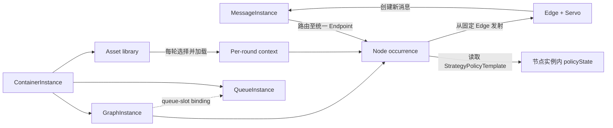
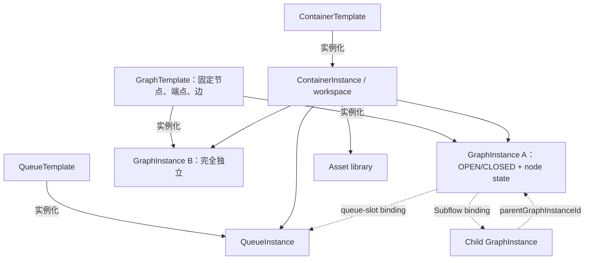

# Nodeflow Runtime V2：五主体运行时讨论稿

> **版本导航（2026-08-14）**：
> - **当前实现入口 = V4**：概念见 [FOUNDATION_V4.md](./FOUNDATION_V4.md)，
>   接口见 [INTERFACES_V4.md](./INTERFACES_V4.md)，代码 `nodeflow_v4.py` 及
>   `nodeflow_*` 模块，测试 `python -m pytest -q`（273 条）。
> - **本文档与 `runtime_v2.py` 是 V2 历史证据**（37 条行为测试仍随全量跑），
>   不代表当前 V4 行为；V4 对 V2 的取舍见 FOUNDATION §6。

> 状态：可执行讨论基线，不是冻结设计，也没有改动原 `nodeflow.md`。

> **版本关系（2026-08-12）**：本文件和 `runtime_v2.py` 保留为已经通过 37 条测试的 V2 行为证据；后续概念设计已上升到通用 Container 元模型。当前概念入口见 [Container 元模型 V3](./CONTAINER_MODEL_V3.md)，协议候选和未决项见 [统一 JSON 协议工作台 V3](./PROTOCOL_WORKBENCH_V3.md)。V3 尚未由本文件中的 Python 模拟器实现。

这次重新建模只允许五组主体进入运行时：

1. 消息与消息队列；
2. 节点，包括 Agent、普通、策略、Start、End、Checkpoint、Subflow；
3. 容器、模板与实例；
4. 边与 Servo；
5. 资产库与上下文。

最重要的纠偏是：**回调等待不是第六套子系统，而是 CALL 消息自身的一组状态。** 当前实现中不存在 `WaitInstance`、`Continuation`、`StrategyCycle`、`InputBuffer`、`OutputBuffer`、`EdgeInstance` 或 `ServoRun`。

## 一、先给结论

当前 37 条行为测试证明了一个足够小的正常运行链：



已经成立的结论：

- 图运行中不修改节点、端点或边；循环也是遍历固定拓扑。
- Endpoint 是统一端点，方向由本次消息操作和边决定，不由“输入口/输出口”两套类型决定。
- Servo 只编辑 JSON payload，不能改写 operation、目标 Endpoint、tags 或回调关系。
- Strategy 由可复用 policy template 组合 readiness、selection 和 output policy；所有字段都必须有执行语义并在绑定节点上通过校验。
- Subflow 只绑定一个已经存在的 child GraphInstance；它用普通 CALL/REPLY 进入和返回，不自动创建子图，也不创建独立等待对象。
- Agent 上下文每次调用重新构造；隐藏会话历史不是编排状态。
- 关闭是进入 End 的授权消息，不是旁路 `close()` API，也不是拓扑修改。

已经收敛的核心结构是：**GraphTemplate 是定义，GraphInstance 就是一次可运行、可关闭的工作实例。** 创建 GraphInstance 即初始化自己的 OPEN 状态、节点状态和节点锁；不再在图实例内部套第二层运行身份。

## 二、最小持久对象与状态

| 所属主体 | 最小对象或内嵌状态 | 为什么需要 | 明确不需要 |
|---|---|---|---|
| 消息 | `MessageInstance` | 路由、因果、CALL 回调、并发投递都由它表达 | `WaitInstance`、`Continuation` |
| 队列 | `QueueInstance` 与 GraphInstance 的 queue-slot binding | 证明队列实例身份、模板匹配和归属 | 当前尚不能声称已有完整 broker/ACK/lease |
| 节点 | GraphInstance 内的 node state | Strategy 暂存、Checkpoint 引用、Subflow binding 均有节点所有者 | `StrategyCycle`、独立输入/输出 Buffer |
| 容器 | `ContainerTemplate`、`ContainerInstance` | owner、可实例化图模板、资产和队列归属 | 额外 WorkspaceRun |
| 图 | `GraphTemplate`、`GraphInstance` | 不可变拓扑与实例私有 binding/context | `EdgeInstance`、`ServoRun` |
| 边 | GraphTemplate 中的静态 edge JSON | 固定源、目标、operation、Servo、CALL reply target | 运行期改边 |
| 资产 | ContainerInstance 下稳定 `assetId -> content` | 实例引用、选择和加载 | Agent 私有隐藏资产库 |

实例关系可以压缩成下面这棵树：



ContainerInstance 是所有权边界：它持有 owner、GraphInstance、QueueInstance 和资产库。GraphTemplate 只描述不可变拓扑；同一模板需要两份并发或隔离工作时，就创建两个 GraphInstance，它们不共享状态、上下文或关闭状态。

正常链路只有三组正交状态：

```text
Message delivery : QUEUED -> CLAIMED -> CONSUMED
CALL callback    : WAITING -> RESOLVED       （非 CALL 为 NONE）
GraphInstance    : OPEN -> CLOSED
```

`CLAIMED` 是 Message 的投递状态，不是一个 Claim 对象。线程锁属于运行设施，不进入快照，也不是业务主体。

## 三、消息与回调：等待到底在哪里

### 3.1 受保护的消息信封

消息分为两部分：

```json
{
  "envelope": {
    "messageId": "msg-17",
    "operation": "CALL",
    "originGraphInstanceId": "parent-1",
    "targetGraphInstanceId": "child-1",
    "sourceEndpoint": "delegate.io",
    "targetEndpoint": "entry.io",
    "causationIds": ["msg-12"]
  },
  "payload": {"job": 7}
}
```

- Runtime 创建并保护 envelope。
- Servo 和 Agent 只能生成或编辑 payload；控制 tags 走受约束的 output wrapper。
- 外部普通入口只能 PUSH。CALL 必须通过 `call()` 或声明了 `replyTarget` 的 CALL edge 创建；REPLY 必须引用精确的 CALL message ID。

### 3.2 CALL 的两条正交状态线

CALL 被目标节点消费后，可以同时满足：

```text
deliveryState = CONSUMED
callbackState = WAITING
```

这不是冲突：前者表示请求已经交付，后者表示返回值尚未到达。REPLY 到达后，Runtime 在原 CALL 上写 `RESOLVED`，记录 reply message，并把 REPLY 投递到 CALL 创建时固定的返回 Endpoint。

两个相同目标的 CALL 即使逆序回复，也只按 `replyToMessageId` 相关，不按“最近调用”、节点名或队列位置猜测。

## 四、QueueInstance：当前只确定到哪里

已确定：

- QueueTemplate 与 QueueInstance 分开。
- GraphTemplate 只声明 queue slot 和所需 QueueTemplate，不写实例 ID。
- GraphInstance 可在创建时绑定，也可由 owner 在之后绑定一个**已经存在**且模板匹配的 QueueInstance。
- 绑定动作不会隐式创建第二个 QueueInstance。
- Message 可记录其 QueueInstance 归属。

没有确定：

- QueueInstance 是否允许由 scheduler 在运行中自动创建；
- 是实例化时创建、首次使用时创建，还是只能由人/外部 MCP 提供；
- shared queue 的 competing consumer、发布订阅、优先级、ACK、lease、重投和 backpressure；
- Queue membership 与 Message store 最终由谁作为唯一真相源。

因此当前代码中的 QueueInstance 是“可绑定的实例身份 + 有序消息引用”，不是完成版消息中间件。下一轮应在以下三种 provision policy 中做选择，但不应现在偷偷默认：

```text
REQUIRE_PREBOUND
OWNER_PROVISION_AT_GRAPH_INSTANTIATION
LAZY_PROVISION_BY_APPROVED_PROVIDER
```

## 五、统一 Endpoint 与节点类型

Endpoint 的规范形式是：

```json
{
  "endpoints": {
    "io": {"accepts": ["PUSH", "CALL", "REPLY"]}
  }
}
```

同一个 `node.io` 可以：

- 接收 PUSH；
- 接收 CALL；
- 接收相关 REPLY；
- 作为固定边的 source 发射新消息。

边仍然有 `from -> to`，但这是一次路由关系，不是把 Endpoint 永久分成 input/output 两类。Start 和 Checkpoint 也已经用单个 `io` Endpoint 完成接收与发射。

节点最小语义：

| kind | 正常路径语义 | 节点实例内允许的最小状态 |
|---|---|---|
| `start` | 将入口消息送入固定边 | 无 |
| `ordinary` | 执行确定性或普通 handler | 无 |
| `agent` | 用本轮 ContextEnvelope 调用 Agent handler | 不保留隐藏对话历史 |
| `strategy` | 原子选择输入，执行 handler，再应用输出策略 | 仅必要的 `policyState` |
| `checkpoint` | 记录最后观察到的 message ID 并继续固定边 | `lastObservedMessageId` |
| `subflow` | 向已绑定 child 发 CALL；REPLY 返回同一节点 | child graph/entry/return binding |
| `end` | 只接收授权 close message，满足 DRAIN 后关闭 | 无额外 `CLOSING` |

测试中的 `sink` 只是观测夹具，不建议作为产品节点种类写入正式概念层。

## 六、Strategy 是策略组合，不是新的运行子系统

当前保留三组真正独立的策略轴：

### 6.1 Readiness

- `ANY`：有可用输入就运行。
- `ALL_REQUIRED`：指定 Endpoint 都有消息才运行。

### 6.2 Selection

- `FIRST`：取一个可用消息，形成流式处理。
- `TOP_ONE`：按字段选择当前候选中的最高项；`unselected=DISCARD|RETAIN` 必须明确。
- `ONE_PER_INPUT`：每个必需 Endpoint 原子取一个，形成 JOIN。
- `CROSS_ALL`：原子取得两个必需 Endpoint 当前全部可用消息，形成**本批次**笛卡尔积。

没有再保留独立 `consume` 字段，因为当前消费方式可以从 selection 唯一推导；保留它只会制造装饰性 JSON。若以后确认历史复用 CROSS，再增加明确的 `CROSS_RETAIN` 语义，而不是把含糊的 `consume=RETAIN` 塞进现有模式。

### 6.3 Output policy

- `EMIT_EACH`：每个结果立即沿匹配边发射。
- `WAIT_ALL(requiredOutputs)`：结果暂存在当前 Strategy node state；全部具备后一起发射，并合并各轮 causation。
- `CROSS(left,right,target)`：将同一次 handler 返回的两组候选交叉成目标 Endpoint 输出。

PolicyTemplate 注册时校验 JSON 字段；GraphTemplate 绑定时再次校验其中引用的输入、输出 Endpoint 都真实存在。Agent 可以按既有 policy 运行和发消息，但不能在运行中注册/改写 policy、GraphTemplate 或边。若 Agent 生成新策略建议，它只能先成为资产或提案，再由 owner/control plane 审批注册。

### 6.4 并发与原子提交

每个 `(graphInstanceId, nodeId)` 使用一个非持久锁：

1. 在短状态锁内选择 QUEUED 消息并写为 CLAIMED；
2. 释放全局状态锁，执行 Agent/handler；
3. 重新进入短状态锁，应用 output policy、Servo、创建所有下游消息；
4. 成功后把本批输入置为 CONSUMED；
5. 提交中发生校验异常时，恢复节点状态、消息集合和原输入 QUEUED 状态。

不同 node occurrence 的 handler 可以并行；`drain()` 遇到在途 CLAIMED 时会等待状态变化，不会假报排空。

这仍是内存 executable spec，不是 durable transaction engine。进程崩溃接管、外部副作用幂等、lease 和 timeout 属后续失败/兜底设计。

## 七、Subflow / Subagent 实例

当前规则故意不让 Subflow 节点自行实例化 child：

1. 人、owner 或外部 MCP 先创建 child GraphInstance；
2. owner 把 parent 的 subflow node occurrence 绑定到该 child、入口 Endpoint 和返回 Endpoint；
3. parent 收到 PUSH 时，Subflow 创建普通 child CALL；
4. child 消费 CALL，随后以普通 REPLY 返回；
5. 若 parent 最初收到的是 PUSH，Subflow 把结果沿本地固定边输出；
6. 若 parent 最初收到的也是外层 CALL，Subflow 解析消息因果链并 REPLY 外层 CALL，不泄漏第二个 WAITING。

每次调用前都会复核 child 仍为 OPEN。child 已关闭时，parent 输入恢复 QUEUED，不会创建一个永远等待的 child CALL。

这条链只使用 Message、Node occurrence binding 和已有 GraphInstance，没有 `SubflowRun` 或 `SubflowContinuation`。

## 八、边、Servo 与固定拓扑循环

Edge 只存在于 GraphTemplate：

```json
{
  "from": "strategy.result",
  "to": "checkpoint.io",
  "operation": "PUSH",
  "servo": {
    "map": {"iteration": "nextIteration"},
    "set": {"normalized": true}
  }
}
```

运行时不创建 EdgeInstance。一次 fan-out 为每条边创建独立下游 Message，Servo 在 payload 副本上工作，原消息和兄弟分支互不污染。

固定边允许形成环：Checkpoint 只观察最新 Message，Strategy 决定继续沿 loop edge，或发 close-tag message 到 End。测试已运行 `Checkpoint -> Strategy -> Checkpoint` 三轮，并在不改拓扑的情况下关闭。

## 九、资产选择、存储与上下文限定

当前最小链：

1. Asset 存在 ContainerInstance 的资产库，以稳定 asset ID 引用；
2. GraphInstance 创建前已解析的 refs 固定为 `context_head`；
3. 实例化后发现的 refs 只能由 owner 审核后追加到该实例 `context_tail`；
4. 每条触发 Message 可带 `assetRefs`；`maxMessageAssets` 只限制本轮消息选择片段；
5. 每次 Agent 调用重新构造 `{head, selected message assets, tail, transient}`；
6. 加载内容使用副本，Agent 修改本轮 context 不回写资产库；`transient` 下一轮清空。

尚未闭环：

- head + message slice + tail 的总 token/字节预算；
- 当总预算不足时 head/message/tail 的优先级与截断规则；
- Asset 类型、版本、选择器、去重和过期；
- 单个资产过大、资产加载失败或资产版本失效时如何降级。

所以“上下文限定”目前只能准确表述为：**消息资产片段有数量限制，调用上下文逐轮重建；总上下文预算仍待设计。**

## 十、GraphInstance 的关闭

关闭消息与普通消息走同一投递机制，只多一个受保护控制 tag：

```text
operation = PUSH
tag       = control.graph.close
target    = End endpoint
```

合法来源：

- Strategy 的受许可输出；
- 通过可信入口认证的上层 controller。

End 只接受 close control message；普通数据不能进入 End 并毒死 DRAIN。当前只支持 `DRAIN`：

- 存在 WAITING callback：不关闭；
- 存在 CLAIMED handler：不关闭；
- 存在其他 QUEUED 工作：不关闭；
- 存在仍 OPEN 的 owned child GraphInstance：不关闭；
- 多个合法 close 同时存在：同一提交关闭并全部消费；
- End 在提交 CLOSED 的同一状态锁内重检 DRAIN；若期间进入新工作，本次关闭延后而不新增 `CLOSING`；
- CLOSED 后拒绝新工作，也不能再追加 context tail、绑定 QueueInstance 或创建 owned child GraphInstance。

模拟器里的 `actor_id` 是测试夹具提供的“已认证主体”，不是安全证明。生产实现必须由网关/身份系统写入可信 principal，不能让 payload 或调用者自由字符串冒充 controller/owner。

## 十一、完整遍历算法

```text
enqueue(Message -> exact graph instance + endpoint)
while GraphInstance is OPEN:
    scan immutable GraphTemplate nodes, End last
    for each node:
        acquire this node occurrence lock
        evaluate readiness + selection against QUEUED messages
        atomically mark selected messages CLAIMED
        rebuild invocation context
        run handler outside global state lock
        apply strategy output policy
        for each matching immutable edge:
            copy payload
            apply Servo
            create downstream PUSH/CALL message
        commit downstream messages + node state + input CONSUMED
        on commit validation failure: roll back this in-memory commit
    if no selectable work but CLAIMED exists:
        wait for state change
    if only authorized close messages remain and DRAIN predicate passes:
        consume close messages and set CLOSED
```

## 十二、已经收束的实例关系

当前模型只有一层运行身份：

```text
GraphTemplate -> GraphInstance(work instance)
```

也就是：

- GraphInstance 自己拥有 OPEN/CLOSED；
- Message 直接路由到 graphInstanceId + endpoint；
- node state、context head/tail、queue binding 都归该 GraphInstance；
- 同模板并发工作就创建多个 GraphInstance；
- 长期发现服务只是一个长期 OPEN 的 GraphInstance；
- child 用 `parentGraphInstanceId` 表达精确所有权，不形成另一套执行身份。

上一版额外引入的 `ScopeState` 已删除，因为它会与 GraphInstance 重复拥有路由 ID、节点状态、锁和 OPEN/CLOSED，造成上下文与关闭边界不明确。它没有被改名成 Run 或 Activation 留下来。

## 十三、当前测试覆盖与运行方式

37 条测试覆盖：

- PUSH fan-out、Servo 与 envelope 边界；
- CALL/REPLY、逆序回调、成功 CALL edge；
- ALL、STREAM、SELECT、JOIN、输入/输出 CROSS、输出 WAIT_ALL；
- worker 竞争、跨 node occurrence 并行、提交回滚、drain 等待；
- 一个节点回滚时另一节点仍在飞、drain quiescence 复检、关闭与晚到消息竞态；
- 授权 close、重复 close、End 拒绝普通数据；
- CLOSED 终态拒绝 owner 配置突变与新 child；
- Subflow 的 PUSH 调用、外层 CALL 调用、child 关闭复核；
- pre-existing queue 创建前/实例化后绑定；
- per-round context、head/tail、GraphInstance 隔离；
- Checkpoint 与固定拓扑循环；
- policy JSON 和 node endpoint 契约校验。

运行：

```powershell
python -m unittest -v
```

这里的测试是行为规格，不是生产性能、持久化或 broker 兼容测试。

## 十四、下一轮建议顺序

1. 决定 Queue 的唯一真相源和 provision policy；在此之前不做 ACK/lease。
2. 决定是否需要历史 `CROSS_RETAIN`；若需要，只把 retained message IDs 和 combination keys 放在 Strategy node state。
3. 定义总上下文预算和 head/message/tail 选择顺序。
4. 最后再进入 timeout、retry、fallback、持久化恢复、外部副作用幂等和真实身份授权。

这个顺序能避免再次围绕某个孤立等待对象或第六套运行子系统扩张，而始终回到五个主体上。
