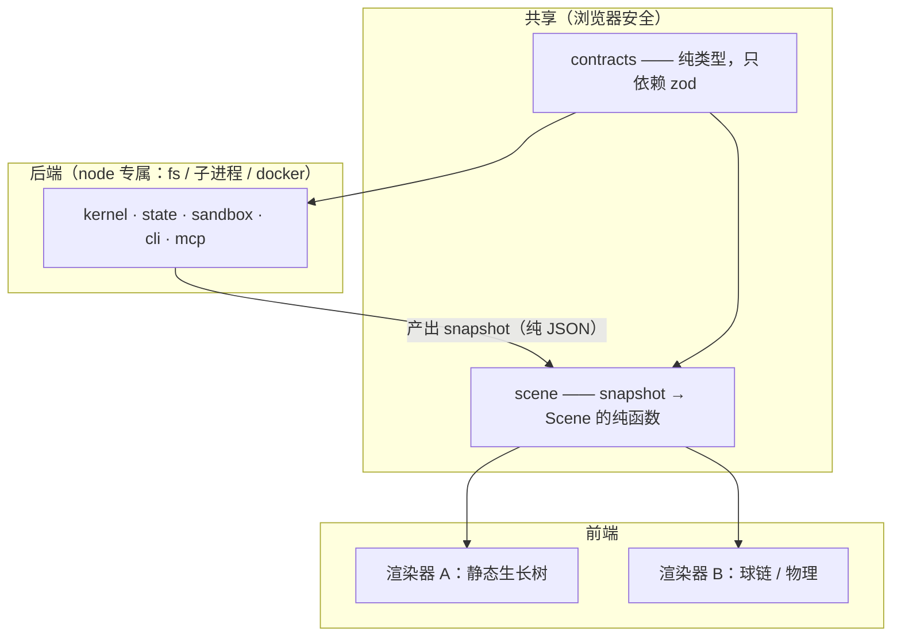

# 渲染核心

> 目标：**同一份数据 → 一套固定的元素词汇 → 多个渲染器。**
>
> 后端换了、逻辑种类多了（比如补 MCP），只增加**适配器**，不增加元素。
> 这份文档只设计"怎么把当前结构渲染出来"，动效与动画是下一轮。

参考 `nodeflow-ui/research/` 的 14 项横向调研。那份调研的总结论是
**「type 注册表 + 纯 JSON 序列化 + 模型与渲染分离」是全部成熟项目的共同架构**——
前两条我们已经有了而且更强（对象库本身就是注册表，且内容寻址带版本），
第三条是这份文档要立的规矩。

---

## 1. 我们与通用节点编辑器的四处结构差异

调研里的通用模型是 **Node / Port / Edge / Graph 四层 + type 注册表 + position 存在节点里**。
我们有四处对不上。每一处都不是风格差异，是模型差异 —— 照抄会拧巴。

### 1.1 嵌套是原语，不是插件

通用做法：`parentId` 字段 + group 节点（React Flow）、embedding 父子（X6）、
scopes 插件（Rete，而且那个插件还是 CC-BY-NC-SA 非商业许可）。

我们：**traceid 就是路径**（不变量 C2），父子关系、深度、子树查询全部从 id 免费得到，
不需要任何额外账本。前端不要再维护一份父子表。

### 1.2 模板与实例天然分离，且覆盖只存差异

调研里只有 BaklavaJS（GraphTemplate ↔ 实例）和 Node-RED
（`subflow:<定义id>` + env 只存差异）走到了这一步，而且被总结为"比复制节点更优雅"。

我们本来就是这个形状：模板是内容寻址对象，`extends` + `override` 只存差异。
**同一个模板实例化 N 次 = N 个 traceid + 1 个模板对象。**
所以前端的"节点长什么样"查模板，"现在是什么状态"查实例 —— 两条独立的查询路径。

### 1.3 连接有两类，且可判定性不同

| | `edges` | `subscriptions` |
|---|---|---|
| 语义 | 内网边，M1 唯一寻址权威 | 网关隧道 + `scope` |
| 两端 | 注册期全查 | `to` 静态已知；**发送方运行期按前缀匹配** |
| 可判定性 | 可判定 | **原理上不可判定** |

`scope: "$self_subtree"` 要匹配的实例在注册时根本还没被创建。所以"自动审核是否固定"
对两类给出的答案永远确定：边能查，隧道查不了。这不是实现没跟上。

### 1.4 没有 position；"type 注册表"就是对象库

通用做法把 `position` 存在节点数据里，把 `type → 定义 → 渲染组件` 建成前端注册表。

我们：布局由物理算或由 `layout` 对象钉住（那个 kind 已经占着位，目前没有生产者）；
类型定义就在对象库里，按 `id@N` 取。

> ⚠️ **不要建第二个注册表。** 这个项目被"两端各自都绿、中间那截没人走"咬过六次
> （§20）。前端再攒一份类型表 / 图状态，它就是第二个真相源，
> 而对不上的时候画面看着完全正常 —— 这类错最贵。

---

## 2. 固定词汇：2 实体 + 2 连接

判据先说在前面：**补 MCP（或任何新后端）时如果需要第五种元素，说明这套词汇错了。**
这是可证伪的，比"看起来够用"强。

### 2.1 `Cell` 胞 —— 有端口、可能有内部

**节点和实例是同一种元素。** 这不是为了省事，是被内核逼出来的：

- 第一次归约说"容器即实例"——所以一个实例不会*变成*容器，它只是有了子实例
- `ChildSlot.entry: PortRef` 定义了**子树如何以单个端口的身份被寻址**

于是折叠视图不是前端发明的简化，**是内核本来就有的那个投影**。折叠/展开无损，
任意深度各自可选，动画是缩放不是变形。

```
叶子节点  = 有端口、内部为空的 Cell
子实例    = 有端口（entry/exit）、内部有 Cell 的 Cell
根容器    = 同上，只是没有父
```

### 2.2 `Card` 卡 —— 无端口、不可寻址、只能被引用

对象/资产。它和 Cell 的区别是**连接方式**而不是外观：
Cell 靠端口被寻址（M1），Card 只能被 `ref` 变量、`bind.card`、`derived_from` 引用。
消息永远不会流向一张卡。

### 2.3 `Flow` 流 —— 可能承载消息的连接

**边和隧道是同一种元素的两个确定度。** 这是这份设计里最实的一条归约：

| | certainty | 何时确定 |
|---|---|---|
| 边 | 恒为 `1` | 注册期证实（两端存在、方向对、契约正文是契约） |
| 隧道 | `0..1`，靠命中累积 | 只能观察 |

于是"染色渐显、多次命中后固化成假边"不是一种特效，
**是 certainty 这个通道的可视化本身**。渲染器不需要知道边和隧道的区别。

一条从没命中过的隧道 certainty = 0，但**仍然要画**——`to: PortRef` 是静态的，
所以画成一条挂在端点上的须。"声明了但从没人往这儿发"是很值钱的观察，
而内核已经在检测它了（`routing.ts` 的 `dangling`：PUBLISH 且 0 订阅者）。

### 2.4 `Tether` 系 —— 不承载消息的连接

三种，共用一个元素、靠 `relation` 区分：

- `contains` 归属 —— 父子，从 traceid 免费得到
- `refs` 引用 —— Cell 用到某张 Card
- `derives` 派生 —— Card 的 `derived_from`，即血缘

它们和 Flow 的区别是**有没有东西在流动**。在树渲染器里归属是枝干，
在球链渲染器里归属是弹簧/包膜 —— 同一份数据，两种读法。

### 2.5 端口是锚点，不是实体

契约、方向、servo 都挂在端口上，但端口不进元素词汇。
它是 Cell 上的**一个锚点**，一份数据同时供命中测试、连线路由、渲染三处用
（照抄 LogicFlow 的锚点设计，调研里被单独点名的那条）。

---

## 3. 通道 —— 适配器与渲染器之间唯一的契约

适配器只填通道，渲染器只读通道，**两边互不知道对方存在**。
这是"固定元素渲染多种逻辑效果"能成立的地方。

```ts
/** 场景 —— 渲染器拿到的全部东西。没有别的入口。 */
export interface Scene {
  readonly cells: readonly Cell[];
  readonly cards: readonly Card[];
  readonly flows: readonly Flow[];
  readonly tethers: readonly Tether[];
  /** 视口 = traceid 前缀。裁剪就是前缀查询（第 9 次复用那套前缀机制）。 */
  readonly viewport: string;
}

export interface Cell {
  readonly id: string;          // traceid，或 traceid + '#' + nodeId
  readonly depth: number;       // 从 traceid 段数免费得到
  readonly parent: string | null;
  readonly ports: readonly Anchor[];

  // ── 通道 ──
  readonly phase: Phase;        // 色相
  readonly activity: number;    // 0..1，最近流量 → 亮度
  readonly extent: number;      // 内部规模 → 泡泡半径 / 子树宽度
  readonly pinned: boolean;     // 钉住 → 不参与物理
  readonly label: string;
}

/** 三个执行状态 + 三个终止，压成渲染需要区分的那几个。 */
export type Phase =
  | "idle"      // 没在跑
  | "running"   // RUNNING，只有 agent 节点会真的停在这儿（见 §6）
  | "done"      // SETTLED / DONE
  | "failed"    // SETTLED / FAILED —— 失败**往下传**
  | "voided";   // VOIDED —— 结果作废，**什么都没往下传**

export interface Flow {
  readonly id: string;
  readonly from: AnchorRef | null;   // ★ 隧道的源端可能未知 —— 见 §5
  readonly to: AnchorRef;
  readonly certainty: number;        // 0..1：边恒 1，隧道靠命中累积
  readonly activity: number;         // 0..1：最近窗口里的流量
  readonly contract?: string;        // 契约 id → 查色表得颜色，**不存颜色**
}

export interface Tether {
  readonly from: string;
  readonly to: string;
  readonly relation: "contains" | "refs" | "derives";
}
```

两条要守住的规矩：

- **颜色不进场景。** 只存 `contract` id，颜色由查色表推导，一个查色函数三处共用
  （端口、连线、选中态）——调研里 Blender 的"类型表与色表分离"、
  Langflow 的"单查色函数三处共用"。契约是内容寻址的，颜色更不该跟着存。
- **位置不进场景。** 场景是拓扑 + 通道，位置是渲染器的事。
  这正是两个渲染器能吃同一份数据的原因。

---

## 4. 场景是纯函数：`scene = f(head, objects)`

**前端不攒任何状态。** 每次事件到达就重算场景。

这条能成立是因为一个巧合般的合拍：`activity` 和 `certainty` 都需要"最近一段历史"，
而 head 里**恰好**保留着最近的已消费消息（`keepConsumedMessages`，默认 200，
那是为了限制头无界增长加的）。于是：

> **染色窗口 = head 里保留的那 200 条已消费消息。**
> 前端不需要自己的历史，一条都不需要。

拿到的好处不是省代码，是三条硬性质：

1. **两个渲染器必然一致** —— 同一个纯函数的两个投影，不可能对不上
2. **刷新可重放** —— 图不会"凉了要重新烧热"，重算即得同一张
3. **多观察者同图** —— 你我看到的染色深浅一样

而且它绕开了 L0（内核没有时钟）：`activity` 用的是**消息序号距离**而不是墙钟。
`msg-N` 是单调的，窗口是"最近 200 条里命中了几次"，纯序号、可重放。

> ⚠️ **计数必须走消息序号，不能走对象版本。** 对象是内容寻址去重的，
> 两次内容相同的命中会被合并成一次 —— 这个坑咬过三次（`loop` 的
> `Date.now() % 1`、`collect` 缺索引）。

**动画插值是渲染器局部的，不是真相。** 场景每帧重算，渲染器在相邻两帧之间补间。
补间状态可以丢，丢了就是没有过渡动画，画面仍然正确。

---

## 5. 内核补的那一个字段：`Message.source`（已完成）

`Message` 原本有 `target` 和 `tunnel`（`routing.ts` 真的在填），但**没有来源**：

| 想画的 | 补之前 |
|---|---|
| 某条隧道的某个订阅端点被命中了几次 | ✅ `tunnel` + `target` 够了 |
| **命中是从哪个实例来的** | ❌ 完全算不出 |
| 扇入边（多条边汇到同一端口）这次是哪条送的 | ❌ 有歧义 |

第二行正是"让浮动节点的命中被看见"这件事本身 —— 没有它，
染色只能染在落点上，**染不出那根来路**。

已补 `MessageSource`，三种情形靠**字段有无**区分，不需要标签：

```
{traceid, node, port}   某节点的 emit 端口发出
{traceid}               实例自身的生命周期通知（子终止 → 父的 exit 端口）
省略                    外部注入（人 / CLI / MCP），图外来的
```

⚠️ **它不进 `MessageEnvelope`。** 信封是 agent 看得到的那份，而"信封里没有任何
路由字段"是 M1（编排权威属于边）的结构性保证。source 一旦进信封，agent 就能
"看谁发来的再决定怎么办"，M1 就从结构性降级成口头约定。它只在内核内部的消息
记录上，随 head 落盘，渲染层从那儿读。

落盘往返有专门用例钉着（`packages/state/test/claim-durability.test.ts`）——
判据不是"内核里有这个字段"，是**换个进程读出来还在**。head 要是白名单序列化把它
丢了，前端就永远拿不到，而两端各自都绿。

**这是渲染需要的唯一一处内核改动。** 其余全部从现有数据推得出来。

---

## 6. 两个渲染器怎么消费同一份场景

| 通道 | 静态生长树 | 球链图（物理） |
|---|---|---|
| `depth` | 层高（y） | 距根的链长 |
| `extent` | 子树宽度 | 泡泡半径 |
| `phase` | 描边色 | 辉光色 |
| `activity` | 连线粗细 | 沿链流动的粒子 |
| `certainty` | 实线 ↔ 虚线 | 连接的可见度与刚度 |
| `pinned` | 手动排序位 | 固定锚点，不受力 |
| `contains` | 枝干 | 包膜 / 弹簧 |

同一份场景，两套投影。切换渲染器不需要重新取数。

**外观基调是气球，不是卡片。** 整体随性、浮动，而不是钉死的网格。
这条定下来之后有个顺手的结果：**`certainty` 直接就是刚度**。

- 边（certainty = 1）把两个 Cell 稳定地拴在一个距离上
- 隧道（certainty 低）让两端飘，命中越多拴得越紧 —— 这就是"逐渐固定显现"
- `pinned` = 完全不飘

于是"染色固化成边"在物理上是**连续**的，不需要在某个阈值上切换渲染方式。
两个渲染器因此比原先设想的更近：静态生长树可以理解成同一套映射的**低温版**，
它们共用 `channel → 物理量` 这张表，只是温度和约束不同。

**⚠️ 同步节点不会"亮"。** 三段式（claim / execute / apply）只对 agent 节点成立，
同步 handler 在一次事务里就提交完了 —— 它没有可观测的 RUNNING 窗口，只会闪一下。
我倾向接受这个区别而不是给最短显示时长：它诚实地区分了
**"真的在外面跑"** 和 **"内核里一瞬间的事"**，那本来就是值得一眼看出来的。

**⚠️ `voided` 要收回，不要走完。** VOIDED 是结果被判作废、什么都没往下传。
动画该是把已经亮起的那团光**收回去**，和 `failed`（失败往下传）明确不同。
它平时罕见，但它出现的时候恰恰最需要看懂。

---

## 7. 从调研里拿什么、不拿什么

**拿：**

- **隐形加宽命中路径**（Node-RED，20px 透明路径包细线）—— 成本极低收益极高，
  而我们**尤其**需要：低 certainty 的隧道线很淡，没有加宽根本点不中
- **类型表与色表分离**（Blender / BaklavaJS）—— 见 §3
- **锚点 = 模型坐标，一份数据三处用**（LogicFlow）—— 见 §2.5
- **视口裁剪**（React Flow）—— 我们的视口就是前缀，裁剪即前缀查询
- **双层 Canvas + 脏标记**（LiteGraph）—— 球链渲染器要，树渲染器不必

**不拿：**

- `position` 存在节点里 —— 见 §1.4
- 前端 type 注册表 —— 对象库就是
- `Graph.version` 迁移入口 —— 对象已经带版本，别开第二条版本轴
- 卡片式节点外观 —— 球链图要 `extent → 半径`，卡片没有半径这个概念；
  而基调已定为气球式浮动（§6），卡片流整个不适用

---

## 8. 分层与解耦：前端不许 import 后端



### 规矩（只有三条，但要真守住）

1. **前端只能 import `@nodeflow/contracts` 和 `@nodeflow/scene`。**
   `kernel` / `state` / `sandbox` / `cli` / `mcp` 一个都不许出现在前端依赖里 ——
   它们碰 `node:fs`、起子进程、调 docker，进不了浏览器，也不该进。
2. **`@nodeflow/scene` 是纯函数，不碰 IO。** 输入是一份普通 JSON 快照，
   输出是 `Scene`。它不知道快照从文件来、从 HTTP 来还是从 WebSocket 来。
   于是它在 node 和浏览器里都能跑，测试也不需要造文件系统。
3. **传输方式不进这两层。** 快照怎么送到前端（轮询 / SSE / WebSocket）
   是后端和前端各自的事，`scene` 不参与。

这三条已经是可行的 —— `@nodeflow/contracts` 现在**零 node 内置、只依赖 zod**，
浏览器安全。这不是巧合：它本来就是"能独立给画布和 LLM 用的纯契约层"
（`instances.ts` 里守 contracts 不依赖 store 的那条边界，理由相同）。

### 建 `packages/scene` 时的第一步

快照里含消息、执行记录、实例，而这几个类型现在住在 `kernel/src/runtime.ts`。
`scene` 若为了拿类型去 import kernel，第 1 条当场就破了。

所以第一步是**把这几个纯类型搬进 contracts**：

| 类型 | 现在在 | 备注 |
|---|---|---|
| `Message` / `MessageState` | `kernel/src/runtime.ts` | 纯数据，无行为 |
| `ExecutionRecord` | `kernel/src/runtime.ts` | 同上 |
| `ContainerInstance` | `kernel/src/instances.ts` | 同上 |
| `RunSnapshot` | 尚不存在 | 上面三样 + 相关对象的信封 |

它们全是没有行为的数据形状，搬过去不动语义。**注意不要顺手做成两份** ——
kernel 里保留一份"给内核用的"、contracts 里再定义一份"给前端用的"，
那正是这个项目被咬过六次的形状。搬，不是抄。

`RunSnapshot` 也别新发明格式：`head.json` 已经是纯 JSON 且已经是落盘契约，
快照就是它加上按前缀取的那批对象。ComfyUI 那套"UI 格式 / API 格式"双格式
（调研 §5.1）我们**不学** —— 一份就够，多一份就多一处会漂的账。

## 9. 待定

- 静态编辑（用户明确说放在显示效果之后）
- `proposal` 落点：观察到的流量够密 → 生成 `proposal` → 人批准 → 变成模板里真正的
  `edge`。`proposal` 已是 kernel kind 且**没有任何生产者和消费者**，正好留给这条路
- 前端框架与渲染技术选型（树用 SVG/DOM、球链用 Canvas 大概率是对的，但先不定）
- 卡片（资产）在两个渲染器里的具体呈现
