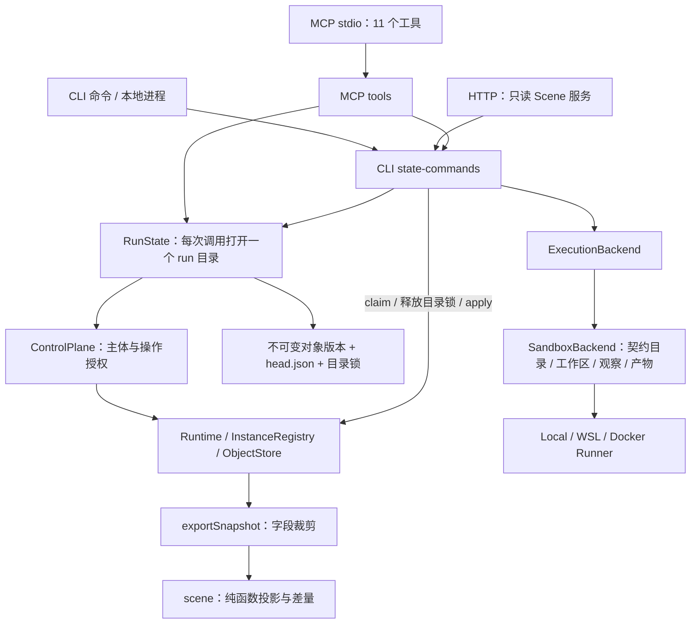

# 当前内核与接口探索：2026-09-06

这是代码与运行实验记录，不是前端设计，也不把旧设计稿当成实现承诺。

基于工作区 `81f622f9d393ddede4dab30bee7955c59316d543` 加用户已有未提交变更，Node v24.14.0。
本轮只新增本目录；没有改动内核、CLI、MCP、页面或旧文档。没有调用模型或读取模型密钥。

## 如何复跑

在仓库根目录运行：

```powershell
corepack pnpm exec tsx experiments/2026-09-06/interface-probe.mts
# 单组，例如校验差异；08、10 会先运行 03 准备数据
corepack pnpm exec tsx experiments/2026-09-06/interface-probe.mts 02
```

每次创建新的系统临时目录，路径记录在结果的 `stateRoot`。不会打开现有 run。
WSL 组在 Ubuntu 中执行固定 shell 命令，写入实验沙箱，通过 CLI 的 drain 驱动；
沙箱使用唯一 traceid，`retain: never`，运行后移除。状态目录和结果保留，便于复查。
MCP 子进程和 HTTP 测试服务在实验结束时关闭。

`OBSERVED` 表示实验完成、取得观察值，不表示产品行为正确。
双驱动、作用域、校验不一致等实验刻意记录当前缺陷。
没有运行模型生成模板，也没有验证真实模型、生产级恢复或多租户隔离。

原始记录：

- [results.json](./results.json)：第一轮 01–10。
- [results-02.json](./results-02.json)：补查依赖缺失在注册/实例化的不同表现。
- [results-04.json](./results-04.json)：补查 callback 普通消息已被消费后，REQUEST 仍未销账。
- [results-09.json](./results-09.json)：最终脚本使用唯一 traceid 的 WSL 复跑。
- [results-11.json](./results-11.json)：消息回收与历史可用性。

## 现在的架构



这张图表达调用关系，不能理解为“所有操作已经统一收口”：
创建根由 init 调 InstanceRegistry，CLI 的 claim/apply 直接调 Runtime，
MCP 写调用与 CLI 写调用注入的校验器也有差别。

### 模板、实例和 run

- 模板是 ObjectStore 中的版本对象，引用形如 `worker@2`。
- 实例记录 `traceid`、`templateRef`、`status`、`generation`、提交序号和物化绑定。
- 一个 RunState 目录拥有自己的 ObjectStore、实例树、消息和执行记录，且只能有一个根。
- 普通节点当前的 `kind` 是 `handler`，执行体通过 `handler` 名称或 `agent` 声明区分。
- 模板内部通过端口和静态边连接；跨容器使用别名绑定；子实例来自父模板已声明的槽。
- 请求、子容器、在途执行等构成未了结义务，LockView 是查询时的派生视图。
- 定义与运行在语义上分离；跨 run 的模板库、运行列表和服务管理尚未形成应用层接口。

源码入口：[control.ts](../../packages/kernel/src/control.ts)、
[instances.ts](../../packages/kernel/src/instances.ts)、
[run-state.ts](../../packages/state/src/run-state.ts)。

### 一次执行

同步 handler 在 Runtime 内消费消息、读写对象、通过声明端口发出结果；提交记录写成 `$run` 对象版本。

Agent 路径是：

1. claim 消息，生成 ExecutionRequest 和 RUNNING 记录，claim 当场持久化。
2. CLI 释放 run 目录锁，调用 ExecutionBackend.run。
3. SandboxBackend 配置工作区、资源与上下文，运行 argv，读取 emissions/产物并收集执行观测。
4. CLI 重新打开目录、应用结果、持久化，再推进同步节点和终结条件。

ExecutionRequest 包括 executionId、traceid、nodeId、agentSpec、vars、端口白名单、limits、priorExecutions。
ExecutionResult 包括 termination、emissions、artifacts、usage、diagnostics；输出端口映射不含目标地址。
主要来源：[execution.ts](../../packages/contracts/src/execution.ts)、
[drain](../../packages/cli/src/state-commands.ts)、[backend.ts](../../packages/sandbox/src/backend.ts)。

`hertaloy agent` 是执行一个节点的模型适配器：读取 request/context、调用模型、校验 emit 和产物、有限重试。
它不是现成的“与人对话维护模板”的应用。外部 Agent 可通过 MCP 的 define/validate 等工具操作定义。
来源：[runAgent](../../packages/cli/src/agent.ts)。

## 当前可调用接口

| 能力 | TypeScript | CLI | MCP | HTTP |
|---|---|---|---|---|
| 模板结构校验 | validate；注册时另有连接与执行面检查 | validate | validate_template | 无 |
| 保存定义版本 | ControlPlane.define | init/run 场景注册；无独立 define 命令 | define_template | 无写入口 |
| 创建根运行 | init / InstanceRegistry.createRoot | init，或不持久化的 run | create_run | 无 |
| 子实例创建 | ControlPlane.spawn | 无独立 spawn 命令 | spawn_child | 无 |
| 投消息 | ControlPlane.send | send | send_message | 无 |
| 推进同步节点 | ControlPlane.run | drain | advance | 无 |
| 推进外部执行 | claim → backend → apply；CLI drain 组装 | drain --runner | advance 明确不跑 Agent | 无 |
| 实例、阻塞查询 | ControlPlane 的 subtree/blockers 等 | status，支持结构化输出 | get_status，返回文本 | Scene 的部分投影 |
| 对象正文与历史 | read/head/history | show/history | read_object/list_versions | 无正文/历史端点 |
| 消息直接前因 | causesOf | why | explain_message | 无 |
| 截断 | truncate | truncate | truncate_instance | 无 |
| 场景与变化 | exportSnapshot/buildScene/diffScenes | scene/watch/templates/authz | 无对应工具 | /scene、/scene/stream、/templates、/authz |

HTTP 实验：无 token 的 /scene 返回 401；有效 token 的 /scene、/templates 返回 200；
旧设计中的 /api/snapshot 和 /api/object/... 返回 404；POST /send 返回 405。
HTTP 的 /scene/stream 是 NDJSON 差量，不是旧设计中的 SSE 游标协议。

MCP 已通过真实 stdio 初始化、tools/list、tools/call get_status 验证，11 个工具均被枚举。
MCP 结果目前是文本 content（部分文本内为 JSON），没有统一结构化结果协议。
CLI CommandResult 的 data 也只覆盖部分命令，不应假定所有命令都支持 --json。

## 实验事实及其边界

| 实验 | 当前实际结果 | 对能力的准确理解 |
|---|---|---|
| 01 模板存储与 pin | 无根时能存 worker@1 并按 ref 读取；/templates 为 {} | 能保存独立定义，但该端点不能发现模板库 |
| 01 发布新版 | worker@2、root@2 发布后，旧 root@1 后续 spawn 仍得到 worker@1；重开目录仍一致 | 创建子实例的时间不是选取最新定义的依据，父绑定也已固定 |
| 01 覆盖层 | 得到 kind=materialized 的完整正文及 derived_from=[worker@2] | 合并结果可用；不能把返回对象当作保留原始 override 草稿的编辑模型 |
| 02 校验差异 | workspace.source=123 被 validate/注入校验器的 define 拒绝，却被 MCP define 接受 | 入口之间没有同一份“可运行”保证 |
| 02 依赖引用 | 无 entry 的子槽可引用 missing@1 并注册，spawn 时失败；有 entry 时注册拒绝 | 模板依赖闭合未在所有注册路径上强制 |
| 03 聚合 | 三条输入得到 parts=[a,b,c]，4 次提交，正常终结；why(msg-4) 只有 msg-3 | 已有直接消息触发因果；不等于通过对象历史读取产生的完整数据血缘 |
| 04 普通 callback 消息 | 人投消息并被 callback handler 消费后，request 锁仍在；正常 reply 才清除 | 不能把任意 callback send 当成完整审批/回复协议 |
| 05 截断 | 在外部执行等待时能查询、截断；迟到输出不进入 sink | 逻辑作废有效；本实验另一条 truncate 调用对原 backend 的 cancel 次数为 0 |
| 06 双驱动 | 首个结果返回前已有 exec-1 和 exec-2；同一 msg-1 被重复执行，随后不变量错误 | 当前不能把多个推进者当作安全协作的运行服务 |
| 07 作用域 | actor 只授权 job/a；run(scope=job/a) 实际处理 job/a 和 job/b | scope 当前是授权参数，不是可靠的子树调度边界 |
| 08 HTTP | Scene 读取可用，写入口与完整对象查询缺失 | 浏览器端还没有完整控制协议 |
| 09 WSL | 真 shell → emit → apply → sink → TERMINAL，2 次提交、0 失败；$exec 记录 result.txt 改动 | 真实执行链可运行；本实验不是模型任务或安全隔离认证 |
| 10 MCP | 真实 stdio 协议与工具调用成功 | 不只是直接调用工具 handler 的单元测试 |
| 11 消息回收 | 600 次输入+600 次输出后保留399条消息；1200条提交记录仍在；msg-1 正文不可取，why(msg-2) 仍为 msg-1 | 能保留因果 ID 关系，不能从当前状态保证完整正文回放 |

## 观测数据的三层不能混用

1. **运行事实**：实例 generation/seq、消息 payload/请求关联、executionId/claim 等存在于运行状态和控制面查询。
2. **对象证据**：`$run` 记录提交的 consumed/produced，`$exec` 记录执行观测，业务产物有版本历史。
3. **渲染投影**：exportSnapshot 已裁掉实例 generation/seq、消息 payload/请求关联、执行 executionId 等字段；Scene 再压成 cell/flow/card/tether。

因此 Scene 适合概览，不能直接作为完整运行检视 API。status 的结构化输出又是另一种摘要，
例如能看到 generation 和 blockers，却没有完整模板正文。
来源：[snapshot.ts](../../packages/state/src/snapshot.ts)、[state-commands.ts](../../packages/cli/src/state-commands.ts)。

## 已知但本轮没有扩展验证的范围

- Windows LocalRunner 的 mkdir ENOENT 和前一轮测试失败没有在本轮修复或重跑整套测试。
- 真实模型生成质量、对话状态、模板草稿生命周期没有测试；现有 MCP 只是可调用工具基础。
- 对象先落盘、head 后替换之间的崩溃窗口从 RunState 代码可见；本轮没有做进程强杀故障注入。
- 未验证 Docker、资源工作区交接、网络策略、完整权限隔离或外部副作用恢复。
- WSL 观测里 networkEnforced=false；Runner 的 isolates 字段是实现声明，本轮仅验证执行路径。

后续讨论应以模板存储/发现、运行驱动所有权、可检视证据、各入口的校验和结果契约为事实基础。
本记录不选择前端框架、布局或最终产品交互。
